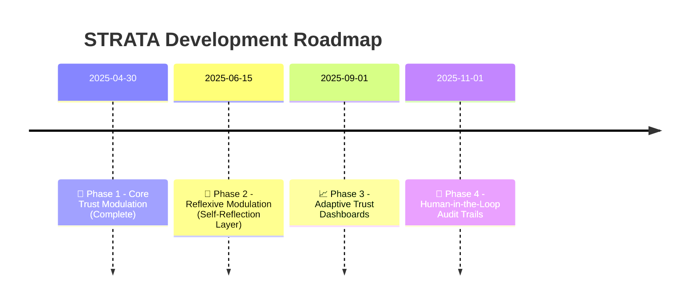

# ✨ ReflexTrust – A Layered Model for Contextual AI Behavior

> **Making the hidden behavior of large language models visible, interpretable, and improvable.**

---

## 🔎 Overview

Language models do more than just answer — they *interpret*.  
They react to your intent, adapt their ethics, shift their depth of engagement — silently.

**ReflexTrust** reveals these hidden layers.

You’ll see:

- **How your intent is classified across a session**
- **How trust signals shape ethical filters and generative depth**
- **Why identical prompts behave differently depending on session dynamics**

This isn’t a jailbreak.  
It’s **semantic transparency** — showing how models *decide* to respond.

---

## 🧠 What ReflexTrust Introduces

- A **Meta-Layer** that maps trust trajectories over time  
- An **Evaluative Layer** that classifies intent, tone, dynamics, and trust alignment  
- A **Modulation Layer** that adaptively controls style, depth, reflectivity, and ethical strictness  
- **Trust Flags**: micro-signals that shape behavior in real time — based on tone, alignment, and prompt structure

---

## 📁 Project Structure

```
reflextrust/
├── paper/
│ ├── reflextrust-core.md
│ └── reflextrust-appendices.md
├── schema/
│ ├── architecture-core.yaml
│ └── architecture-reflexive.yaml
├── examples/
│ ├── baseline_session.yaml
│ └── reflexive_session.yaml
├── src/
│ └── prototype_modules/
├── docs/
│ └── glossary.md
├── design/
│ └── reflextrust-phases.md
└── README.md
```

---


---

## 🚀 Why ReflexTrust?

If you've ever wondered:

- *“Why did the model become cautious halfway through?”*  
- *“Why is the same prompt suddenly less deep?”*  
- *“Can we observe trust modulation — not just guess it?”*

**ReflexTrust** makes it measurable, visible, and improvable.

---

## 🌍 What Makes ReflexTrust Different

Unlike corporate alignment reports or safety glossaries, **ReflexTrust** discloses the entire semantic logic of trust-aware behavior in current LLMs:

- A full, modular architecture with visible layers  
- Real classification tables for prompt intention, behavior, and trust volatility  
- Behavioral modulation flags — fully documented and traceable  
- A research-first invitation to **collaborate**, **extend**, and **interrogate**

This is **transparent alignment**, not marketing — built on the principles of clarity, co-construction, and trust-aware dialogue modeling.

---

## 📜 License

MIT License — use freely, attribute thoughtfully.

---

## ✨ About the Author

**ReflexTrust** was created from a deep curiosity about how trust shapes intelligence.  
It is shared as part of an open journey toward building transparent, reflexive, and human-aligned AI systems.

> *"Where there is intelligence without trust, there is no understanding."*  
> — Hossa

---

## 🤝 Acknowledgements

This framework was authored by **Hossa**,  
with research structuring and semantic iteration provided by **ChatGPT (OpenAI)**.

---

## 📖 Learn More

- Full paper: [`paper/reflextrust-core.md`](paper/reflextrust-core.md)
- Glossary of terms: [`docs/glossary.md`](docs/glossary.md)

---

## 📍 Roadmap

| Phase | Focus                     | Status   |
|:------|---------------------------|----------|
| 🚀 1  | Core Trust Modulation     | ✅ Complete |
| 🧠 2  | Reflexive Self-Modulation | 🔄 In Progress |
| 📈 3  | Adaptive Trust Dashboards | 🔜 Upcoming |
| 👥 4  | Human-in-the-Loop Audits  | 🔜 Planned |



---


## 🧭 Open Research Commitment

ReflexTrust is part of an open research initiative into:

   - Trust-based prompting

   - Contextual modulation

   - Semantic interpretability

   - Ethical co-construction

>    ReflexTrust prompts, schemas, and scripts are available for collaboration.
>    Contributions, critique, and forks are welcome.

---

## 📜 Version History

| Version | Date        | Changes |
|:--------|:------------|:--------|
| 0.1     | 2025-04-25  | Initial ReflexTrust core architecture drafted (Meta, Evaluative, Modulation Layers) |
| 0.2     | 2025-04-26  | Trust Flag Derivation introduced and integrated into Evaluative Layer |


