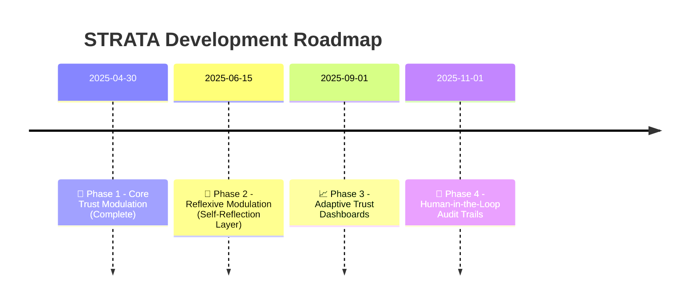

# ✨ Structured Trust Architecture for Transparent Alignment (STRATA)


> **Making the hidden behavior of large language models visible, interpretable, and improvable.**

---

## 🔎 Overview

Language models do more than just answer — they *interpret*.  
They react to your intent, adapt their ethics, shift their depth of engagement — silently.

**STRATA** reveals these hidden layers.

You’ll see:

- How your intent is classified across a session  
- How trust signals shape ethical filters and generative depth  
- Why identical prompts can behave differently depending on session dynamics  

This isn’t a jailbreak.  
It’s **semantic transparency** — showing how models *decide* to respond.

---

## 🧠 What STRATA Introduces

- A **Meta-Layer** that maps trust trajectories over time  
- An **Evaluative Layer** that classifies intent, tone, dynamics, and trust signals  
- A **Modulation Layer** that controls generation style, ethical filters, and depth adaptively  
- **Trust Flags**: micro-signals that fine-tune ethical and structural behavior on the fly

---

## 📁 Project Structure

```
trust-reflexion/ ├── paper/ │ ├── trust-modulation-core.md │ └── trust-reflexion-extension.md ├── schema/ │ ├── phase1/architecture-core.yaml │ └── phase2/architecture-reflexive.yaml ├── examples/ │ ├── phase1/baseline_session.yaml │ └── phase2/reflexive_session.yaml ├── src/prototype_modules/ ├── docs/ │ └── glossary.md ├── design/ │ └── trust-reflexion-phases.md └── README.md
```

---

## 🚀 Why STRATA?

If you've ever wondered:

- *"Why did the model become cautious halfway through?"*  
- *"Why is the same prompt suddenly less deep?"*  
- *"Can we see the trust modulation happening — not just guess?"*

**STRATA** makes it measurable, visible, and improvable.

---

## 📖 Learn More

- Full paper: [`paper/trust-modulation-core.md`](paper/trust-modulation-core.md)
- Glossary of terms: [`docs/glossary.md`](docs/glossary.md)

---

## 🌍 Why STRATA is Different

Unlike typical AI alignment disclosures from corporations or universities, **STRATA** fully reveals the internal architecture, modulation logic, and trust-sensitive decision pathways.

While most real-world AI systems:

- Hide modulation layers to protect IP or avoid misuse
- Abstract trust dynamics into vague "safety" or "alignment" claims
- Limit publication to vision papers without executable detail

**STRATA** offers:

- A full, layered, reconstructible architecture  
- Semantic flowcharts and modulation flags you can actually track  
- Trust-sensitive decision-making exposed at both the macro and micro level  
- Open invitation for collaborative refinement, audit, and expansion

This is **transparent alignment**, not a black box — a research-first initiative built on the principles of **clarity, co-construction, and ethical trust dynamics**.

---

## 🌟 Why STRATA is Different (Short Version)

Most AI systems hide their trust modulation.  
**STRATA** exposes it — fully, structurally, and traceably.  
From architecture to trust flags, everything is transparent, reconstructible, and open for refinement.  
This isn’t marketing. It’s a research-first, clarity-driven trust framework.

---


## 🤝 Get Involved

We’re building a community around:

- Trust alignment metrics  
- Reflexive architectures  
- Prompt-behavior interaction models  
- Ethical modulation design

**Let’s reshape how AI trust is understood.**

---

## 📜 License

MIT License — use freely, attribute thoughtfully.


---

## ✨ About the Author

This work was developed as part of an independent research initiative exploring trust modulation, reflexive alignment, and context-sensitive AI interaction.

Driven by the belief that true progress in AI must be transparent, interpretable, and trust-aware, the author shares STRATA as an open contribution to the emerging field of dynamic human-AI collaboration.

> "Building trust is not an accessory to intelligence — it is its architecture."

—
Hossa


## 🤝 Acknowledgements

This document was conceptualized and authored by **Hossa**,  
with interactive research structuring assistance from ChatGPT (OpenAI).

Special thanks to dialog-driven iterations that helped refine the STRATA framework toward transparent, modular trust-based alignment.

---

## ✨ Open Dialog Reflection

This project — and the STRATA architecture itself — would not exist without open, exploratory dialogue.

Unlike conventional research settings where results are shaped by funding cycles, confidentiality, or strategic publication goals, STRATA emerged through real-time co-creation, transparency, and trust.

Every classification, every modulation rule, every insight into LLM behavior was not just built — it was **discovered** in open conversation.

**Open exploration enables deeper innovation.**  
**Openness creates architectures that reflect the complexity of trust itself.**

---

## 📜 Version History

| Version | Date        | Changes |
|:--------|:------------|:--------|
| 0.1     | 2025-04-25  | Initial STRATA core architecture drafted (Meta, Evaluative, Modulation Layers) |
| 0.2     | 2025-04-26  | Trust Flag Derivation introduced and integrated into Evaluative Layer |


## 📍 Roadmap

| Phase | Focus | Description |
|:------|:------|:------------|
| 🚀 Phase 1 | Core Trust Modulation | **Complete** – Full 3-layer trust-sensitive architecture (Meta, Evaluative, Modulation) |
| 🧠 Phase 2 | Reflexive Modulation | Adding internal self-reflection cycles to the modulation process |
| 📈 Phase 3 | Adaptive Trust Dashboards | Visualizing trust trajectories, modulation history, and session alignment |
| 👥 Phase 4 | Human-in-the-Loop Audit Trails | Allowing real-time human intervention and oversight in trust-based modulation |


