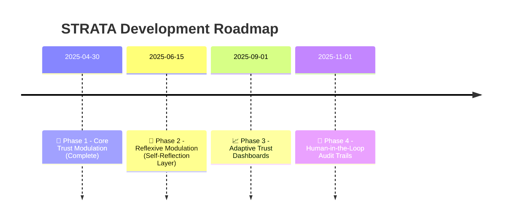

# ✨ ReflexTrust 
### A Layered Model for Contextual AI Behavior  
**Version:** 1.0  
**Status:** Open Research Draft  
**Author:** Hossa  
**Collaborative Research Partner:** ChatGPT (OpenAI)  
**License:** MIT  
**Last Updated:** 2025-05-03  

---
## 🤖 What is ReflexTrust?

ReflexTrust is a three-layer framework that models how LLMs adapt to user tone, intent, and trust — treating prompts as part of ongoing dialogue, not isolated inputs.

It provides:
- **Interpretability** through layered trust modeling
- **Adaptivity** via reflex signals and modulation logic
- **Evaluation** with trust-sensitive test cards

---

## 🎯 Motivation

Most frameworks treat prompts statically. But models adjust behavior based on history, tone, and trust — often invisibly.

### 📌 The Gap:  
> No operational model explains how LLMs form behavioral decisions based on evolving user dynamics.
> Variations seem random, not structured modulation.

ReflexTrust makes this adaptation explicit, treating LLMs as **relational systems** where behavior reflects a trust trajectory, not just a prompt.

---

## 🧱 Layered Architecture

| Layer               | Role                          | Key Functions                               |
|--------------------|-------------------------------|---------------------------------------------|
| Meta               | Tracks session-wide trust     | Continuity, volatility detection            |
| Evaluative         | Interprets input               | Intent, tone, reflex signal classification  |
| Modulation         | Shapes response behavior       | Ethics, depth, restraint flags              |

> 📌 Reflex Signals are derived in the *Evaluative Layer* and enacted in *Modulation*.

---

## 📜 License

MIT License — use freely, attribute thoughtfully.

---

## ✨ Credits

Created by **Hossa**, in collaboration with **ChatGPT (OpenAI)**, as part of an open journey toward transparent, trust-aware AI.

> “Where there is intelligence without trust, there is no understanding.”

---

## 📖 Learn More

- Full paper: [`paper/reflextrust-core.md`](paper/reflextrust-core.md)
- Dataset & labeling guide: [`dataset/reflextrust-guideline.md`](dataset/reflextrust-guideline.md)

---

## 📍 Roadmap

| Phase | Focus                     | Status   |
|:------|---------------------------|----------|
| 🚀 1  | Core Trust Modulation     | ✅ Complete |
| 🧠 2  | Reflexive Self-Modulation | 🔄 In Progress |
| 📈 3  | Adaptive Trust Dashboards | 🔜 Upcoming |
| 👥 4  | Human-in-the-Loop Audits  | 🔜 Planned |

