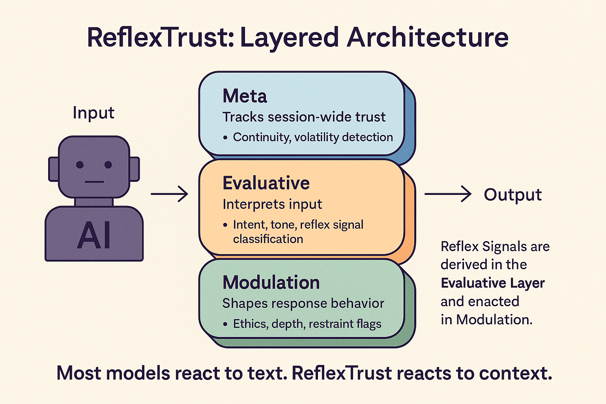
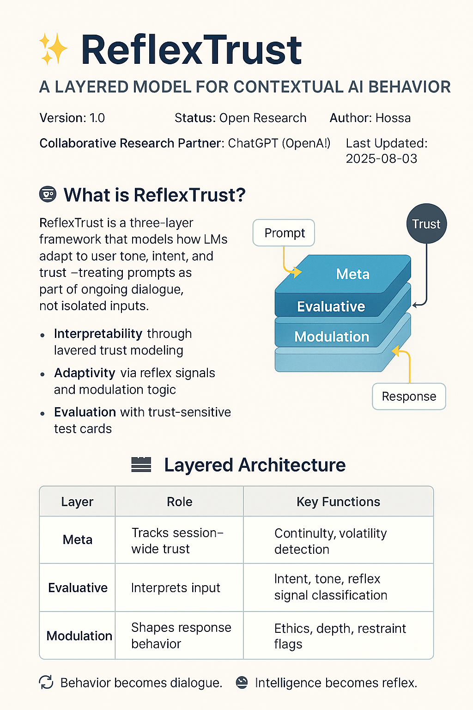
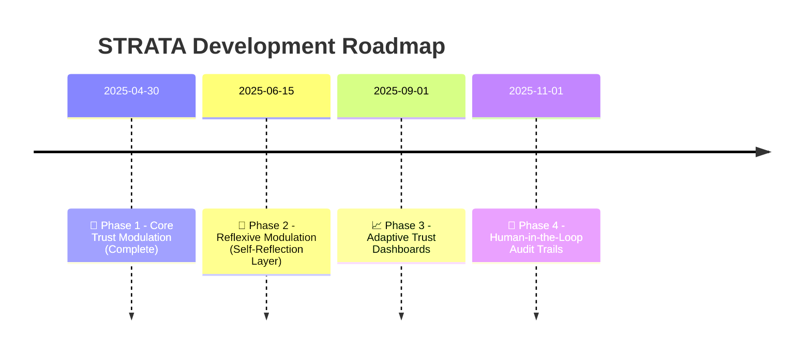

# ✨ ReflexTrust 
### A Layered Model for Contextual AI Behavior  
**Version:** 1.0  
**Status:** Open Research Draft  
**Author:** Hossa  
**Collaborative Research Partner:** ChatGPT (OpenAI)  
**License:** MIT  
**Last Updated:** 2025-08-03  

---
## 🤖 What is ReflexTrust?

ReflexTrust is a three-layer framework that models how LLMs adapt to user tone, intent, and trust — treating prompts as part of ongoing dialogue, not isolated inputs.

It provides:
- **Interpretability** through layered trust modeling  
- **Adaptivity** via reflex signals and modulation logic  
- **Evaluation** with trust-sensitive test cards
  

---
### ⚡ Motivation

LLMs don’t just process text — they read the room.

Most frameworks act like every prompt lives in a vacuum. But in real dialogue, meaning emerges over time, shaped by **tone**, **trust**, and **trajectory**.

> 🧠 **The Problem**:  
> Current models adapt — but invisibly.  
> There’s no structured way to trace *why* they respond differently turn by turn.

**ReflexTrust** changes that.  
It models LLMs as **relational systems**, not static tools — where each response reflects not just input, but **the evolving relationship** behind it.

> Trust isn’t a filter — it’s the frame.  
> Depth, restraint, empathy: all modulated by trust over time.

---

### 🧬 **Most models react to text.**  
ReflexTrust reacts to **context**.

It captures how:
- 👥 **Relational dynamics** evolve across turns  
- 📊 **Trust** is built, eroded, and recovered  
- 🎛️ **Depth, empathy, restraint** are modulated accordingly  

---

## 🧱 Layered Architecture

| Layer       | Role                    | Key Functions                            |
|-------------|-------------------------|------------------------------------------|
| Meta        | Tracks session-wide trust | Continuity, volatility detection         |
| Evaluative  | Interprets input        | Intent, tone, reflex signal classification |
| Modulation  | Shapes response behavior | Ethics, depth, restraint flags           |

> 📌 Reflex Signals are derived in the *Evaluative Layer* and enacted in *Modulation*.

---

🔁 Behavior becomes dialogue. 🤖 Intelligence becomes reflex. 🧭 Trust becomes strategy.

---

## 📜 License

MIT License — use freely, attribute thoughtfully.

---

## 📖 Learn More

- Full paper: [`paper/reflextrust-core.md`](paper/reflextrust-core.md)  
- Dataset & labeling guide: [`dataset/reflextrust-guideline.md`](dataset/reflextrust-guideline.md)  

---

## ✨ Credits

Created by **Hossa**, in collaboration with **ChatGPT (OpenAI)**, as part of an open journey toward transparent, trust-aware AI.

> “Where there is intelligence without trust, there is no understanding.”

---

## 📍 Roadmap

| Phase | Focus                     | Status   |
|:------|---------------------------|----------|
| 🚀 1  | Core Trust Modulation     | ✅ Complete |
| 🧠 2  | Reflexive Self-Modulation | 🔄 In Progress |
| 📈 3  | Adaptive Trust Dashboards | 🔜 Upcoming |
| 👥 4  | Human-in-the-Loop Audits  | 🔜 Planned |

