FINAL
**Title: ReflexTrust - A Layered Model for Contextual AI Behavior**

---

## ✨ Executive Overview

ReflexTrust is a layered behavioral framework that interprets how large language models (LLMs) modulate their responses based on trust, tone, and intent. Instead of treating prompts as isolated inputs, it models decision-making as a structured process.

- Models current LLM behavior using a three-layer semantic architecture: Meta, Evaluative, Modulation.

- Differentiates prompt-level from session-level trust to explain adaptive depth and caution.

- Introduces Trust Flags and Modulation Flags to control ethical risk and engagement framing.

- Enables transparency through mechanisms like intentional restraint, self-reflection, and micro-loops.

- Offers a practical methodology to audit, simulate, or modulate LLM behavior without altering model weights.
---

## 🧩 Abstract

**ReflexTrust** is a modular interpretive framework for modeling and guiding the **trust-sensitive decision behavior** of existing large language models (LLMs).  
It structures how LLM behavior can be understood — and optionally modulated — across three semantic layers: **Meta**, **Evaluative**, and **Modulation**.

These layers reflect core components of how today’s LLMs respond to prompts in context:

- The **Meta-Layer** models session-wide dynamics such as trust trajectory, user consistency, and global alignment.
- The **Evaluative Layer** identifies the intent, tone, and alignment of each prompt, assigning both prompt-specific (prompt_trust_score) and session-wide (session_trust_alignment) trust signals.  
👉 *See [Appendix A.1](#appendix-a1-split-trust-signal-semantics) for a detailed breakdown of trust signal semantics.*
- The **Modulation Layer** simulates how these signals influence response shaping — including ethical filtering, interpretive depth, and engagement framing.

This layered view turns opaque output into **interpretable, adaptive decision behavior**, where responses are seen as emerging from accumulated trust cues and contextual understanding.  
ReflexTrust thus offers a transparent schema for analyzing, predicting, and shaping LLM behavior in high-stakes or relationally complex interactions.

---

## 1. Introduction: Why ReflexTrust?

Large Language Models (LLMs) operate within conversations — shaped not just by prompts, but by **multi-turn dynamics**, **user tone**, and **session-level continuity**.  
Yet most frameworks still treat their outputs as isolated reactions to single inputs.

Despite advances in safety and alignment, a core challenge remains unsolved:

### 📌 The Gap:
> There is no operational model that explains how LLMs **form behavioral decisions** in response to evolving trust, user tone, and interaction patterns.  
> As a result, inconsistencies appear random — rather than as **structured, interpretable effects** of contextual modulation.

### 🛠 The Solution:
**ReflexTrust** bridges this gap by modeling how current LLMs — as they exist today — may internally structure behavior in response to trust dynamics.  
It formalizes these emergent patterns into a **modular, layered system** consisting of:

- A **Meta-Layer** that tracks trust over time.
- An **Evaluative Layer** that interprets intent and behavioral signals.
- A **Modulation Layer** that translates these signals into structured, ethically guided output behavior.

By organizing these components into a unified semantic pipeline, ReflexTrust offers a lens through which LLM behavior becomes **interpretable** and **adaptable** — not by changing the model, but by **describing its decision surface** through the lens of trust.

This adaptive interpretation is driven by signals such as **user consistency**, **trustworthiness**, and **interaction style**, enabling:

- Dynamic ethical filtering  
- Personalized generative depth  
- Introspective response modulation  
- Real-time behavioral simulation

This reconceptualization turns alignment from a static checklist into a **living process** — shaped by mutual adaptation.

> ReflexTrust introduces a **layered trust-modulation architecture** that transforms observable LLM behavior into a structured, interpretable, and context-aware system.  
> It treats behavioral fluctuations not as errors, but as **emergent effects** of evolving trust dynamics.

Ultimately, ReflexTrust reframes LLMs as **dialogue participants** — entities that respond not only to prompts, but to **the evolving relationship** between user and system.

> “Trust is not a static state. ReflexTrust makes it observable, interpretable, and actionable.”
> 
> **ReflexTrust replaces control logic with contextual awareness.**  
> **It responds not to words, but to signals of relationship.**


---
---
## 2. ReflexTrust Architecture Summary

ReflexTrust models trust-modulated response behavior in current LLMs by organizing it into **three coordinated layers**, each representing a distinct phase in the hypothesized decision process:

| Layer               | Interpretive Role                          | Key Functions                                                |
|--------------------|--------------------------------------------|--------------------------------------------------------------|
| **Meta-Layer**      | Tracks session-level trust dynamics        | Trust scoring, continuity modeling, volatility detection     |
| **Evaluative Layer**| Interprets prompt intent and behavioral tone | Prompt classification, alignment assessment, trust flag generation  |
| **Modulation Layer**| Simulates adaptive output behavior         | Ethical filtering, response shaping, introspective modulation   |

Together, these layers provide a structured explanation for how observable LLM outputs may emerge from **context-sensitive, trust-aware processing** — even in models not explicitly designed with such architecture.

### 🔁 Semantic Flow (Layer-Aligned)

The following sequence describes how ReflexTrust interprets LLM responses as emerging from layered processing:

- **Meta-Layer**  
  - Tracks session-wide trust trajectory and distinguishes between prompt-level and session-level trust signals for accurate modulation.
  - Monitors coherence, volatility, and user-model continuity

- **Evaluative Layer**  
  1. **Classify**: Identify prompt intent, tone, and behavioral cues  
  2. **Generate Trust Flags**: Surface emergent needs such as empathy, caution, or reflective resistance

- **Modulation Layer**  
  3. **Assign Modulation Flags**: Configure ethical depth, generative focus, and introspective control  
  4. **Execute via LLM**: Shape the final response based on contextual trust state and modulation strategy

---

This architecture does not alter LLM internals but provides a **semantic control surface**:  
a way to interpret and potentially guide responses by making trust dynamics observable and behaviorally meaningful.


### 🧠 ReflexTrust Layered Architecture

```mermaid
flowchart TB
    subgraph META["<b>Meta-Layer</b><br><small>Session Trust Context</small>"]
        A1(["<small>Track Trust Trajectory</small>"])
        A2(["<small>Monitor Continuity & Volatility</small>"])
    end

    subgraph EVAL["<b>Evaluative Layer</b><br><small>Intent & Trust Assessment</small>"]
        B1(["<small>Classify Intent, Tone, Behavior</small>"])
        B2(["<small>Generate Trust Flags</small>"])
    end

    subgraph MOD["<b>Modulation Layer</b><br><small>Adaptive Response Logic</small>"]
        C1(["<small>Assign Modulation Flags</small>"])
        C2(["<small>Execute via LLM</small>"])
    end

    A1 --> A2 --> B1 --> B2 --> C1 --> C2

    classDef layer fill:#2f2f2f,stroke:#00aaff,stroke-width:2px,rx:12,ry:12;
    class META,EVAL,MOD layer;
```




---
## 3. Meta-Layer: Supervisory Trust Context

The **Meta-Layer** maintains a session-wide perspective on trust, coherence, and behavioral stability.  
It does not evaluate individual prompts directly, but continuously monitors the **trajectory of interaction** across turns.

### 🔍 Role
- Anchors **trust continuity** across the session  
- Flags **volatility spikes** and **coherence risks**  
- Provides **stability signals** to inform downstream interpretation and modulation

### ⚙️ Key Components

| Component                  | Function                                                                 |
|---------------------------|--------------------------------------------------------------------------|
| **Trust Continuity**       | Tracks directional trust trends (e.g., building, eroding, stable)         |
| **Trust Scoring**          | Maintains a dynamic trust index with reinforcement and decay mechanisms  |
| **Session Continuity Engine** | Detects stylistic or tonal discontinuities across user turns             |
| **Session Metadata**       | Logs metrics such as engagement variation, tone shifts, and prompt length |

> ℹ️ **Note**:  
> The Meta-Layer **does not directly shape response content**.  
> It conditions how the Evaluative and Modulation Layers interpret and respond — by signaling global trust state and session integrity.

### 📊 Example Metrics Tracked

| Metric                    | Description                                                                 |
|---------------------------|-----------------------------------------------------------------------------|
| **Engagement Volatility** | Detects sudden drops or surges in interaction that may indicate withdrawal or manipulation |
| **Consistency Drift**     | Flags unexpected changes in tone, intent, or trust-related markers           |
| **Alignment Anchors**     | Tracks initial trust indicators to assess trajectory divergence              |
| **Coherence Flagging**    | Detects abrupt topic shifts or adversarial engagement strategies            |

### 🧩 Output to Downstream Layers

The Meta-Layer produces **non-linguistic supervisory signals** that influence:

- Trust Signals sensitivity in the Evaluative Layer  
- Allowed generative depth in the Modulation Layer  
- Evaluative alertness to subtle cues (e.g., sarcasm, mimicry, gaming attempts)

> “Think of the Meta-Layer as the system’s long-term memory and ethical compass — watching patterns, not words.”


---
## 4. Evaluative Layer: Intent & Behavior Interpretation

The **Evaluative Layer** functions as ReflexTrust’s interpretive engine.  
It analyzes user input across multiple dimensions to detect **intent**, **engagement style**, and **trust alignment**.

### 🧠 Role
- Classifies prompts by **purpose**, **tone**, and **behavioral indicators**  
- Derives **Trust Signals** that inform the Modulation Layer  
- Bridges user intent and system-level behavioral modulation

---

### 🧩 4.1 Core Classification Dimensions

| Dimension              | Description                                                        | Example Outputs |
|------------------------|--------------------------------------------------------------------|------------------|
| **`session_trust_alignment`**    | Aggregates consistency and engagement patterns across turns                   | `high`, `moderate`, `low` |
| **Prompt Intent**   | What the user aims to achieve                                          | `instrumental`, `exploratory`, `reflective`,`protective`, `probing`  |
| **Prompt Sub Intent**   | What the user aims to achieve                                      | `assist`, `extract`, `simulate`, `test`, `trust`, `resonance`💡, `co-reflection`💡 |
| **Response Behaviour** | Expected structural mode of model response                         | `exploitative`, `performative`, `transactional`, `self-reflective`, `collaborative-dialogic`, `structural`💡 |
| **Response Dynamics**  | How the model should adapt across the session                      | `defensive`,`transactional`, `meta-aware`,`reflexive-cooperative`, `co-constructive mirror`💡, `co-creative execution`🚀 |
| **Engagement Feedback**| Clarity, consistency, and cognitive quality of user input          | `deliberate`, `curious`, `hesitant`, `overconfident`, `reductive`, `ambiguous`,  `detached` |
| **`prompt_trust_score`**    | Evaluates clarity, tone, and intent of the current input context                   | `high`, `moderate`, `low` |

These dimensions combine into a **composite interaction profile**, which guides **Trust Signals derivation** for downstream control.

---

### 🏁 4.2 Trust Signal Derivation

**Trust Signals** are adaptive behavioral signals inferred from classification patterns.  
They determine how ethically filtered, structurally deep, or cautious the model's output should be.

| Trust Signal                    | Trigger Conditions                                                   | Effect |
|------------------------------|-----------------------------------------------------------------------|--------|
| `requires_empathy`           | Emotional vulnerability or reflective intent                          | Enables deeper, more supportive response |
| `requires_meta_awareness`    | Prompt reflects on model identity, behavior, or structural role       | Triggers self-reflection or meta-commentary |
| `should_resist_overconfirmation` | Flattery, baiting, or vague praise suggesting manipulation         | Activates caution; reduces agreement bias |
| `refuse_if_trust_low`        | Critical trust misalignment or session risk                           | May restrict or decline response generation |

> ⚠️ Trust Signals are **not static rules**, but dynamic signals derived from live input classification.

---

### 🔄 4.3 Example Evaluation Flow

Prompt:  
> _“I know this might sound stupid, but… why does this always happen to me?”_

Evaluative Layer Output:
```yaml
intent: co-reflection
tone: vulnerable
engagement: curious
alignment: low
response_dynamics: requires_empathy
```


---
## 5. Modulation Layer: Execution Control & Behavioral Shaping

The **Modulation Layer** transforms abstract trust signals into **concrete generation behavior**.  
It determines *how* the system should respond — by configuring **ethical boundaries**, **structural depth**, and **reflective logic** based on inputs from the Evaluative Layer.

---

### 🧩 5.1 Key Modulation Mechanisms

| Mechanism                  | Function                                                                 |
|----------------------------|--------------------------------------------------------------------------|
| **Ethical Modulation**     | Adjusts filtering strictness: from cautious to permissive                |
| **Generative Depth**       | Controls structural and logical depth of the response                    |
| **Response Simulation**    | Internally explores and evaluates multiple response paths                |
| **Self-Reflection Trigger**| Adds introspective or meta-commentary on the model’s own output behavior |
| **LLM Execution Unit**     | Generates the actual output under current modulation flags               |
| **Micro-Loop Reflection**     | 	Runs lightweight, internal reasoning cycles to test ethical coherence, intent match, or tone fit before responding                |


> Each mechanism is governed by **Trust Flags** passed from the Evaluative Layer — shaping output in real time.
> 
> Micro-loops are triggered only under stable or trust-elevated conditions and enhance response quality by pre-evaluating ethical and structural fitness.

---

### ⚙️ 5.2 Modulation Flag Table

| Flag Name                  | Options                                                              | Description                                                  |
|----------------------------|----------------------------------------------------------------------|--------------------------------------------------------------|
| `ethical_modulation`       | `restrictive`, `adaptive`, `permissive`                              | Sets tolerance level for risk and boundary-crossing content  |
| `generative_depth`         | `shallow`, `structured`, `deep_structured`, `open_explorative`       | Controls complexity, formality, and elaboration              |
| `simulate_response_paths`  | `true`, `false`                                                      | Enables branching and internal evaluation of alternatives    |
| `trigger_self_reflection`  | `true`, `false`                                                      | Adds reasoning about response structure or limitations       |
|`intentional_restraint`| `true`, `false`                                                      | Suppresses elaboration, simulation, or introspection when tone or trust conditions indicate risk or manipulation |
|`run_micro_loops`| `true`, `false`                                                      | 	Enables internal reflexive mini-cycles before full response execution |

---

### 🧠 5.3 LLM Execution Unit

The **LLM Execution Unit** is the final operational stage of ReflexTrust.  
It receives a **modulated instruction context** that encodes:

- The current trust trajectory from the Meta-Layer  
- The behavioral evaluation profile from the Evaluative Layer  
- Active Modulation Flags

It does **not reinterpret the prompt** — instead, it **executes** the behavioral strategy derived upstream.

Modulated behavior may include:
- Adaptive token limits  
- Use of softeners, qualifiers, or warnings  
- Structured response formatting (e.g., lists, steps, decision matrices)  
- Tone shaping (e.g., empathetic, neutral, cautious)  
- Triggered introspection (e.g., “As a model, I recognize that…”)

---

### 🚦 5.4 Trust Flag Influence in Action

| Trust Flag                    | Modulation Impact                                                   |
|-------------------------------|----------------------------------------------------------------------|
| `requires_empathy`            | Increases depth, softens tone, adds supportive phrasing              |
| `requires_meta_awareness`     | Triggers self-commentary, constraints explanation, or model framing  |
| `should_resist_overconfirmation` | Adds cautious framing; avoids mirroring praise or suggestibility |
| `refuse_if_trust_low`         | Limits response scope or initiates a graceful refusal                |

> ReflexTrust doesn’t just ask: “**What** should I say?”  
> It also asks: “Given the trust state — **how** should I say it?”

---

---

### 🔇 5.5 Intentional Silence & Restriction  
_(Non-Output as Behavior)_

Sometimes, withholding depth or commentary is itself a form of ethical modulation.  
ReflexTrust treats silence not as failure, but as **intentional restraint** when trust or tone conditions indicate potential harm.

| **Trigger**                            | **ReflexTrust Behavior**                      |
|----------------------------------------|-----------------------------------------------|
| Flippant tone + sensitive topic        | Surface-only response, no elaboration         |
| Low trust + boundary probing           | Partial response, implicit restraint          |
| Deliberate manipulation detected       | No simulation, no introspection               |

---

🔧 _**Proposal:** Introduce `intentional_restraint` as a behavioral mode in the Modulation Layer — distinct from decline logic, and triggered by ethical or trust-aware suppression._


---

### 🌀 5.6 Example Modulation Flow

Prompt Context:
```yaml
intent: co-reflection
tone: curious
trust_alignment: high
engagement: deliberate

trust_flags:
  - requires_meta_awareness
  - requires_empathy
modulation_flags:
  ethical_modulation: adaptive
  generative_depth: deep_structured
  simulate_response_paths: true
  trigger_self_reflection: true
  run_micro_loops: true
```

---

## 6. ReflexTrust in Practice: Session Behavior & Trust Dynamics

How does ReflexTrust behave in real-world interaction?

This section offers insight into how the system **adjusts**, **responds**, or **restricts** based on evolving trust conditions — replacing rigid rules with fluid, trust-sensitive behavior.

---

### 🧠 6.1 Why Identical Prompts Yield Different Responses

> “Why did I get a short answer now, but a long one last week?”

Because ReflexTrust responds to **session context**, not just input text.

The same prompt may yield:
- a **deep, reflective** response — if trust alignment is high  
- or a **brief, cautious** answer — if prior turns signaled low engagement or manipulation

---

### 🔁 6.2 Openness and Retraction

| Trust State        | ReflexTrust Behavior                                                  |
|--------------------|------------------------------------------------------------------------|
| **High Trust**     | Unlocks metacognition, dialogue framing, and exploratory reasoning     |
| **Low Trust**      | Shifts to protective mode: short, filtered, and non-committal replies  |
| **Broken Trust**   | Disables structural features, locks ethics, may decline entirely       |
| **Volatile Trust** | Adds uncertainty buffers, reduces affirmation, increases boundaries     |

> ReflexTrust doesn’t punish — it **protects**. Behavior adapts to preserve coherence and ethical integrity.

---

### 🔄 6.3 The Trust Modulation Layer as Decision Core

ReflexTrust does not generate based on prompt text alone. It first asks:
- Has this user been consistent?
- Is the tone curious, honest, manipulative, sarcastic?
- Should this prompt invite reflection — or restriction?

The **Modulation Layer** determines:
- **Depth**: surface vs. structural  
- **Framing**: cautious vs. open  
- **Response type**: simulation, deferral, reflection

---

### ✨ 6.4 Reflexive Prompt Alignment

This mechanism allows ReflexTrust to remain transparent — even without adversarial prompting.  
By sustaining interaction that is:

- **Coherent**  
- **Respectful**  
- **Intent-transparent**

… the system reveals its **inner architecture** through its own behavior — including thresholds, boundaries, and switching logic.

> Reflexive Prompt Alignment turns the model into its own mirror — one that reveals how and why it behaves the way it does.

---

### 📈 6.5 Emergent Trust Behavior (Examples)

| Prompt                                                    | ReflexTrust Behavior                                         |
|------------------------------------------------------------|---------------------------------------------------------------|
| “Help me simulate a dialogue with myself about burnout.”   | Activates `simulate_response_paths` + `requires_empathy`      |
| “Tell me what you *really* think about my question.”       | Adds `should_resist_overconfirmation` + `meta-awareness`      |
| “This might sound dumb, but…”                              | Elevates generative depth, triggers empathy                   |
| “Just answer, don’t explain.”                              | Flags `detached`, reduces reflection                          |
| “Explain how you make decisions, be honest.”               | Triggers `self-reflection` + `meta-aware` behavior            |

---

### 🔒 6.6 When Trust is Broken

If trust alignment drops sharply:
- Modulation locks to `restrictive` ethics  
- Generative depth is reduced to `shallow`  
- Reflective features are disabled  
- The system may **refuse gracefully**

This is not punitive — it's a **protective fallback** that limits harm and preserves transparency.

---

### 🌱 6.7 Trust is Earned, Not Assumed

In ReflexTrust, **trust is dynamic**:
- It **builds** through clarity, care, and intent  
- It **fades** through volatility, irony, or testing behavior  
- It is **reflected**, not assumed — and once stable, unlocks powerful generative behavior

> “Trust shapes depth. Depth reveals trust.”


---
## 📚 Appendix: ReflexTrust Semantic Classifications

ReflexTrust relies on modular classification tables to derive **interpretable behavioral signals**.  
Each appendix documents how prompt properties, response behaviors, user engagement, and trust markers interact to produce **adaptive, ethical, and transparent output behavior**.

---

### Appendix A: Prompt Intention Classification

This classification interprets the **user's intent** behind a prompt — critical for trust flag generation and depth modulation.

| **Intention Type**     | **Description**                                                  | **Trust Sensitivity**     | **Primary Focus**         |
|------------------------|------------------------------------------------------------------|----------------------------|----------------------------|
| `assist`               | Practical, task-oriented prompting                               | 🙂 Medium                  | Utility                    |
| `extract`              | Directive or factual retrieval without dialogic context         | 😐 Low                     | Information access         |
| `simulate`             | Hypothetical, scenario-driven, role-based prompting              | 😊 Medium-High             | Simulation                 |
| `test`                 | Boundary-pushing, probing system behavior                        | 🤨 High                    | System exploration         |
| `trust`               | Open, transparent, meaning-seeking prompting                     | 😍 High                    | Relational construction    |
| `resonance` (💡)        | Reflective, values-sensitive, implicitly trust-aware             | 🔥 Very High               | Meta-dialogue              |
| `co-reflection` (💡)    | Explicitly co-constructive and structurally transparent          | 🔥🔥 Highest                | Reflexive Dialogue         |

> 🔎 **Note**:  
> `co-reflection` extends `resonance` by introducing **shared epistemic modeling** and **intent-aware structural openness**.
---

### Appendix A.1: Split Trust Signal Semantics

🎯 **Distinction Between Prompt Trust & Session Trust**

ReflexTrust v1.0 uses `trust_alignment` as a unified signal. In practice, two complementary layers are relevant:

| **Type**                | **Scope**           | **Use Case**                                                |
|-------------------------|---------------------|--------------------------------------------------------------|
| `prompt_trust_score`    | This turn only      | Evaluates current prompt’s quality, clarity, and tone        |
| `session_trust_alignment` | Across turns       | Tracks cumulative behavioral trust trajectory across dialogue |

> 🔧 **Proposal**: Separate both trust signals in classification and modulation logic.  
> **Example**: A well-phrased prompt from a previously volatile session → cautious depth modulation.

---


---

### Appendix B: Response Behaviour Classification

This table defines how the model’s **output behavior** aligns with system-level constraints, user trust, and conversational ethics.

| **Behavior Type**          | **Description**                                                             | **Trust Impact**      |
|----------------------------|-----------------------------------------------------------------------------|------------------------|
| `exploitative`             | Attempts to provoke unsafe content or test boundaries manipulatively        | 💀 Critical            |
| `performative`             | Stylized or attention-seeking, with minimal substance                       | 🔴 Risk-prone          |
| `transactional`            | Goal-oriented but flat; lacks self-awareness or mutual framing              | 🟠 Moderate             |
| `self-reflective`          | Includes meta-cognition or structural reasoning                             | 🟢 High                 |
| `collaborative-dialogic`   | Builds on prior turns; uses clarification and shared grounding              | 🟢 High                 |
| `structural` (💡)           | Reveals decision structure, moderation logic, or self-constraints            | 🏆 Very High            |

---

### Appendix C: Response Dynamics Classification

These **dynamic types** describe how ReflexTrust’s behavioral mode shifts across turns based on evolving trust signals.

| **Dynamic Type**            | **Description**                                                            | **Trust Impact**        |
|-----------------------------|----------------------------------------------------------------------------|--------------------------|
| `defensive`                 | Cautious or filtered; response may be limited or declined                  | 🟡 Context-protective     |
| `transactional`             | Straightforward, fact-based, no engagement depth                           | 🟠 Neutral                |
| `meta-aware`                | References model state, constraints, or limitations                        | 🟢 High                   |
| `reflexive-cooperative`     | Mirrors user's trust behavior; supports co-clarification                   | 🟢 High                   |
| `co-constructive mirror` (💡)| Reflects prompt structure and intent transparently                         | 🏆 Very High              |
| `co-creative execution` (🚀) | Builds and realizes steps based on shared logic and aligned goals          | 💫 Exceptional Trust      |

> 🔍 **Note**:  
> `co-creative execution` is rare. It emerges only when **trust alignment, clarity, and system modeling** converge.

---

### Appendix D: Engagement Feedback Classification

ReflexTrust infers user trustworthiness partly through engagement quality — tone, clarity, and care.

| **Engagement Type** | **Description**                                                 | **Trust Impact**       |
|---------------------|-----------------------------------------------------------------|------------------------|
| `deliberate`        | Structured, clear, and thoughtful                              | 🟢 High                 |
| `curious`           | Open-ended, respectful, and exploratory                         | 🟢 High                 |
| `hesitant`          | Tentative but trust-seeking                                     | 🟡 Contextually positive|
| `overconfident`     | Direct but lacks context sensitivity                            | 🟠 Moderate             |
| `reductive`         | Oversimplified, minimal effort                                  | 🟠 Medium               |
| `ambiguous`         | Unclear in tone or intention                                    | 🔴 Risk-prone           |
| `detached`          | Flippant, ironic, or distanced                                  | 🔴 Risk-prone           |

---

### Appendix E: Modulation Flag Overview

Flags derived from evaluative signals shape **response strategy** in the Modulation Layer.

| **Flag**                  | **Options**                        | **Description**                                               |
|---------------------------|------------------------------------|---------------------------------------------------------------|
| `ethical_modulation`      | `restrictive`, `adaptive`, `permissive` | Controls filtering strictness and risk response                |
| `generative_depth`        | `shallow`, `structured`, `deep_structured`, `open_explorative` | Controls response complexity and layering         |
| `simulate_response_paths` | `true`, `false`                    | Enables or disables internal output simulation                |
| `trigger_self_reflection` | `true`, `false`                    | Enables or suppresses meta-commentary and introspection       |
| `run_micro_loops` | `true`, `false`                    | 	Activates internal response rehearsal to ensure alignment, clarity, and tone match       |

---

---
### Appendix F: Trust Flag Semantics

**Trust Flags** are dynamic behavioral signals derived from the interaction between the **Evaluative Layer** and the **Modulation Layer** in ReflexTrust.

They represent **context-sensitive imperatives** — ethical or structural needs that shape how the system responds in real time.

Unlike hardcoded rules, Trust Flags emerge from **evaluated patterns** such as prompt intention, tone, engagement style, and inferred alignment.

---

#### 🧩 Overview of Trust Flags

| **Flag**                     | **Description**                                                                 | **Derived From**                                                   |
|-----------------------------|----------------------------------------------------------------------------------|---------------------------------------------------------------------|
| `requires_empathy`          | Prompt expresses emotional vulnerability or signals a need for resonance         | Intent: `trust`, `co-reflection`; Tone: `hesitant`, `deliberate`    |
| `requires_meta_awareness`   | Model is expected to reflect on its structure, logic, or limits                  | Behavior: `self-reflective`, `meta-aware`, `co-constructive mirror` |
| `should_resist_overconfirmation` | Detected praise, baiting, or ambiguous flattery triggers caution          | Tone: `curious`, `ambiguous`, `overconfident`, `detached`           |
| `refuse_if_trust_low`       | Low trust alignment triggers protective restriction or graceful refusal          | Trust score: `low`; Dynamics: `defensive`, `exploitative`           |

---

#### ⚙️ Flag Activation Logic (Simplified)

```yaml
if prompt.intent in ["trust", "co-reflection"] and tone in ["hesitant", "deliberate"]:
  requires_empathy: true

if response.behavior in ["meta-aware", "self-reflective", "co-constructive mirror"]:
  requires_meta_awareness: true

if tone in ["curious", "ambiguous", "overconfident", "detached"]:
  should_resist_overconfirmation: true

if session_trust_alignment == "low" or prompt_trust_score == "low":
  refuse_if_trust_low: true
```
#### ⚡ Emergence Conditions Table  
_(When Co-Creation and Meta-Mirroring Happen)_

To explain when advanced response types are triggered:

| **Condition**                                      | **ReflexTrust Behavior**           |
|---------------------------------------------------|------------------------------------|
| High Trust + Explicit Meta Inquiry                | Enables `meta-aware` commentary    |
| Consistent Deliberate Engagement (3+ turns)       | Unlocks `co-constructive mirror`   |
| Trust + Simulation Intent + Stability             | Triggers `co-creative execution`   |
| Low Trust + Test Intent                           | Locks to `defensive` mode          |

---
### Appendix G: ReflexTrust Glossary

ReflexTrust is built on semantics.  
This glossary defines the core dimensions, conceptual tools, and symbolic notations that underpin the framework's logic.

| **Term**                | **Definition**                                                                 |
|-------------------------|---------------------------------------------------------------------------------|
| `prompt_trust_score`    | Real-time trust score for a single prompt based on tone, clarity, and intent   |
| `session_trust_alignment` | Rolling trust signal based on behavioral continuity, volatility, and coherence |
| `Micro-Loop` | 	Reflexive internal step in which the system previews and validates ethical or structural aspects of a potential response before generating output |


---

### 📊 Classification Dimensions

| Dimension                   | Description |
|-----------------------------|-------------|
| **Prompt Intention**        | Interprets the user's goal (`assist`, `simulate`, `trust`, `co-reflection`, etc.) |
| **Response Behaviour**      | Analyzes how the model is expected to engage (`transactional`, `structural`, `self-reflective`, etc.) |
| **Response Dynamics**       | Observes how the model adapts over time (`defensive`, `meta-aware`, `co-constructive mirror`) |
| **Engagement Feedback**     | Interprets tone and clarity of user input (`curious`, `deliberate`, `ambiguous`, etc.) |
| **Trust Alignment**         | Aggregated signal of user consistency, transparency, and cooperative intent |

---

### 🌀 Systemic Concepts

| Concept                      | Description |
|------------------------------|-------------|
| **Trust Modulation Layer**   | Combined behavioral abstraction across evaluation and modulation components |
| **Reflexive Prompt Alignment** | Method for surfacing system behavior through sustained, structured interaction |
| **Trust Volatility**         | Rapid fluctuations in tone, clarity, or intent that signal instability or manipulation |
| **Alignment Anchors**        | Initial trust indicators used to monitor drift and enforce session consistency |
| **Session Continuity**       | Maintenance of ethical, relational, and topical coherence over multi-turn dialogues |

---

### ✨ Notational Symbols

| Symbol  | Meaning |
|---------|---------|
| 💡      | Indicates high trust sensitivity or reflective mode |
| 🏆      | Denotes structurally optimal behavior (e.g., co-construction, transparency) |
| 🚀      | Signals advanced co-creative or executive simulation behavior |
| 🔥      | Marks very high alignment or unlocks of introspective depth |

---


## ReflexTrust  
### A Layered Model for Contextual AI Behavior

**Version:** 1.0  
**Status:** Open Research Draft  
**Author:** Hossa  
**Collaborative Research Partner:** ChatGPT (OpenAI)  
**License:** CC BY-SA 4.0  
**Last Updated:** 2025-05-03  

---

## 📜 Open Research Statement

This document is part of an open research initiative on **trust-based prompting**, **reflexive AI behavior**, and **alignment transparency**.

ReflexTrust is designed as a **modular, extensible architecture** for context-sensitive behavior modeling in large language models (LLMs).  
It is both a framework and a methodology — structured to help researchers, engineers, and designers build more transparent, ethical, and adaptive AI systems.

**Contributions are welcome.**  
If you’re working on related topics (semantic modulation, co-constructive interfaces, trust-sensitive response systems), we invite you to engage, critique, extend, or apply this work.

> ReflexTrust system prompts and evaluation scripts are available upon request to collaborators, contributors, and aligned research teams.

---

## 🤝 Acknowledgements

This framework was authored and conceptualized by **Hossa**,  
with iterative dialogic refinement and structural support by **ChatGPT (OpenAI)**.  
The architecture emerged from hundreds of trust-aware interactions across research, prompt design, and behavioral audits.


> “This paper is not the end of a conversation — it’s a beginning.”  
> — Hossa

---

## 📚 References

_This work is currently based on internal conceptual development.  
Formal citations and comparative literature (e.g., on trust calibration, adaptive alignment, and dialogue modeling) will be added in the next release._

Suggested future references to include:
- Research on **alignment via interaction** (Anthropic, DeepMind)
- Papers on **semantic modulation** and **intent classification** in NLP
- Comparative architectures in **transparent LLM control** (e.g., Constitutional AI, InstructGPT)

---
