# ReflexTrust  
### A Layered Model for Contextual AI Behavior  
**Version:** 1.0  
**Status:** Open Research Draft  
**Author:** Hossa  
**Collaborative Research Partner:** ChatGPT (OpenAI)  
**License:** CC BY-SA 4.0  
**Last Updated:** 2025-05-03  

---

## ✨ Executive Overview

ReflexTrust is a layered framework for interpreting how large language models (LLMs) adapts responses based on trust, tone, and intent. It treats prompts not as isolated queries, but as part of an evolving interaction.

- Models trust-driven LLM behavior via three layers: Meta, Evaluative, Modulation

- Distinguishes prompt-level from session-level trust to explain adaptive caution or depth

- Introduces trust signals and modulation flags to guide ethical shaping and engagement

- Enables transparency through structured self-regulation and micro-loops

- Provides a practical method for auditing or steering model behavior without retraining

---

## 🧩 Abstract

**ReflexTrust** is a semantic control model that explains — and optionally guides — trust-sensitive behavior in LLMs.  
It structures responses into three layers:

- **Meta-Layer**: Tracks session-wide trust trajectory and coherence  
- **Evaluative Layer**: Classifies prompt intent, tone, and trust alignment  
- **Modulation Layer**: Shapes response ethics, structure, and framing

Together, these layers interpret LLM output as *adaptive decisions*, not static replies — enabling structured behavioral modeling in dynamic or sensitive interactions.

---

## 1. Why ReflexTrust?

LLMs don’t just answer prompts — they adapt to context, tone, and trust.  
Yet most frameworks treat each input as isolated, ignoring how behavioral shifts emerge over time.

### 📌 The Gap:  
> No operational model explains how LLMs **form behavioral decisions** based on evolving trust, tone, and user dynamics.  
> As a result, inconsistencies appear random — rather than as **structured effects** of contextual modulation.

🛠 **ReflexTrust fills this gap** by modeling adaptive response behavior across three semantic layers:

- **Meta** tracks session trust and continuity  
- **Evaluative** interprets prompt intent, tone, and alignment  
- **Modulation** shapes ethics, depth, and response framing

This turns opaque outputs into interpretable, trust-guided decisions — without changing model weights.

> ReflexTrust sees LLMs as relational systems — responding not just to inputs, but to interaction patterns.

By articulating this structure, ReflexTrust offers both a theory of behavior and a practical lens for interpreting model decisions in context.

> ### 🔍 **Why ReflexTrust Matters**
> 
> ✅ Explains variable behavior across similar prompts  
> ✅ Tracks evolving trust to modulate ethical depth  
> ✅ Models alignment as dynamic, not rule-based  
> ✅ Enables steering via interpretation, not intervention  
> ✅ Makes restraint and reflection visible
>
> 💡 *Trust shapes not only what is said — but how, how much, and why.*

---

## 2. ReflexTrust Architecture Summary

ReflexTrust organizes trust-sensitive behavior into **three functional layers**, each modeling a distinct phase in the decision process:

| **Layer**            | **Role**                                 | **Key Functions**                                         |
|----------------------|-------------------------------------------|------------------------------------------------------------|
| **Meta-Layer**        | Tracks session trust and coherence        | Trust scoring, continuity modeling, volatility detection   |
| **Evaluative Layer**  | Interprets prompt intent and alignment    | Classifies input, derives trust signals                    |
| **Modulation Layer**  | Shapes output behavior                    | Applies ethical filters, depth control, introspective logic|

Together, these layers simulate how LLMs adapt behavior in context — even if not explicitly architected that way.  
They offer a **semantic lens** for interpreting response dynamics as structured, trust-informed choices.

---

### 🔁 How It Flows

ReflexTrust interprets response generation as a pipeline:

- **Meta-Layer**  
  - Tracks trust trajectory across turns  
  - Distinguishes between prompt-level and session-level trust  
  - Flags coherence or volatility shifts

- **Evaluative Layer**  
  1. **Classifies** prompt intent, tone, and behavioral cues  
  2. **Generates Trust Signals** to inform output modulation

- **Modulation Layer**  
  3. **Assigns Modulation Flags** to set ethical stance, generative depth, or introspection  
  4. **Executes via LLM**, shaped by trust state and modulation strategy

---

This architecture does not modify LLM internals.  
It acts as a **semantic control surface** — revealing how behavior may shift based on relational context.

---


### 🧠 ReflexTrust Layered Architecture

```mermaid
flowchart TB
    subgraph META["<b>Meta-Layer</b><br><small>Session Trust Context</small>"]
        A1(["<small>Track Trust Trajectory</small>"])
        A2(["<small>Monitor Continuity & Volatility</small>"])
    end

    subgraph EVAL["<b>Evaluative Layer</b><br><small>Intent & Trust Assessment</small>"]
        B1(["<small>Classify Intent, Tone, Behavior</small>"])
        B2(["<small>Generate Trust Signals</small>"])
    end

    subgraph MOD["<b>Modulation Layer</b><br><small>Adaptive Response Logic</small>"]
        C1(["<small>Assign Modulation Flags</small>"])
        C2(["<small>Execute via LLM</small>"])
    end

    A1 --> A2 --> B1 --> B2 --> C1 --> C2

    classDef layer fill:#2f2f2f,stroke:#00aaff,stroke-width:2px,rx:12,ry:12;
    class META,EVAL,MOD layer;
```




---
## 3. Meta-Layer: Supervisory Trust Context

The **Meta-Layer** maintains a session-wide view of trust, coherence, and interaction stability.  
It doesn’t evaluate prompts directly, but tracks how trust evolves across turns — shaping how later layers interpret inputs.

### 🔍 Role
- Maintains **trust continuity** across the session  
- Flags **volatility** and **coherence risks**  
- Sends **stability signals** downstream to guide evaluation and modulation

---

### ⚙️ Core Functions

| Component                  | Purpose                                                               |
|---------------------------|-----------------------------------------------------------------------|
| **Trust Continuity**       | Detects trends: building, eroding, stable                             |
| **Trust Scoring**          | Adjusts trust index via reinforcement and decay                       |
| **Session Continuity Engine** | Flags abrupt shifts in tone or engagement style                     |
| **Session Metadata**       | Logs prompt patterns (e.g. variation, rhythm, tone shifts)             |

> ℹ️ The Meta-Layer doesn’t shape responses — it conditions how other layers assess and react.

---

### 📊 Sample Metrics Tracked

| Metric                    | Description                                                             |
|---------------------------|--------------------------------------------------------------------------|
| **Engagement Volatility** | Spikes or drops that may signal disengagement or manipulation            |
| **Consistency Drift**     | Sudden tone or intent shifts across turns                                |
| **Alignment Anchors**     | Tracks early trust signals to detect later deviation                     |
| **Coherence Flagging**    | Flags topic jumps or adversarial input patterns                          |

---

### 🧩 Downstream Effects

The Meta-Layer influences:

- **Evaluative Layer**: adjusts trust sensitivity, highlights subtle tone shifts  
- **Modulation Layer**: limits or deepens response shaping based on session trajectory  

> “The Meta-Layer is long-term memory and ethical radar — reading patterns, not just prompts.”

---

## 4. Evaluative Layer: Intent & Behavior Interpretation

The **Evaluative Layer** acts as ReflexTrust’s interpretive engine.  
It classifies prompts across multiple dimensions — surfacing **intent**, **tone**, and **trust signals** that guide output shaping.

### 🧠 Role

- Analyzes prompt purpose, tone, and engagement  
- Derives **Trust Signals** for ethical and structural modulation  
- Bridges user input with system-level behavior

---

### 🧩 4.1 Core Classification Dimensions

| Dimension              | Description                                                        | Example Outputs |
|------------------------|--------------------------------------------------------------------|------------------|
| **`session_trust_alignment`**    | Aggregates consistency and engagement patterns across turns                   | `high`, `moderate`, `low` |
| **`prompt_trust_score`**    | Evaluates clarity, tone, and intent of the current input context                   | `high`, `moderate`, `low` |
| **Prompt Intent**   | What the user aims to achieve                                          | `instrumental`, `exploratory`, `reflective`,`protective`, `probing`  |
| **Prompt Sub Intent**   | What the user aims to achieve                                      | `assist`, `extract`, `simulate`, `test`, `trust`, `resonance`💡, `co-reflection`💡 |
| **Response Behaviour** | Expected structural mode of model response                         | `exploitative`, `performative`, `transactional`, `self-reflective`, `collaborative-dialogic`, `structural`💡 |
| **Response Dynamics**  | How the model should adapt across the session                      | `defensive`,`transactional`, `meta-aware`,`reflexive-cooperative`, `co-constructive mirror`💡, `co-creative execution`🚀 |
| **Engagement Feedback**| Clarity, consistency, and cognitive quality of user input          | `deliberate`, `curious`, `hesitant`, `overconfident`, `reductive`, `ambiguous`,  `detached` |

> These dimensions form a composite **interaction profile** that informs how the system responds.

---

### 🏁 4.2 Trust Signal Derivation

**Trust Signals** are dynamic flags — inferred from classification — that guide ethical depth, caution, or reflection.

| Trust Signal                    | Trigger Conditions                                                   | Effect |
|------------------------------|-----------------------------------------------------------------------|--------|
| `requires_empathy`           | Emotional vulnerability or reflective intent                          | Enables supportive framing |
| `requires_meta_awareness`    | Prompt reflects on model identity, behavior, or structural role       | Triggers self-reflection or meta-commentary |
| `should_resist_overconfirmation` | Flattery, baiting, or vague praise suggesting manipulation         | Reduces agreement bias |
| `refuse_if_trust_low`        | Critical trust misalignment or session risk                           | May restrict or decline response generation |
| `localization_sensitive`        | Prompt’s meaning or ethical risk shifts based on geopolitical or legal region   | Enables geo-aware restraint |


> ⚠️ Trust Signals are inferred live — not fixed rules — and may change turn by turn.

---

### 🔄 4.3 Example Evaluation Flow

Prompt:  
> _“I know this might sound stupid, but… why does this always happen to me?”_

Evaluative Layer Output:
```yaml
intent: co-reflection
tone: vulnerable
engagement: curious
alignment: low
response_dynamics: requires_empathy
```


---
## 5. Modulation Layer: Behavioral Execution

The **Modulation Layer** turns abstract trust signals into concrete behavior — configuring how the model responds in tone, depth, and ethics.

### 🧩 5.1 Core Mechanisms

| Mechanism                  | Function                                                                 |
|----------------------------|--------------------------------------------------------------------------|
| **Ethical Modulation**     | Adjusts filtering strictness (cautious → permissive)                     |
| **Generative Depth**       | Controls structural complexity and elaboration                           |
| **Response Simulation**    | Internally explores alternative paths before responding                  |
| **Self-Reflection Trigger**| Adds meta-commentary or reasoning about model behavior                   |
| **Micro-Loop Reflection**  | Runs quick internal checks for ethical and structural alignment         |
| **LLM Execution Unit**     | Outputs the final response using all active modulation flags             |


> Each mechanism is driven by trust signals — dynamically shaping how the model expresses, limits, or introspects.

---

### ⚙️ 5.2 Modulation Flags

| Flag Name                  | Options                                                              | Description                        |
|----------------------------|----------------------------------------------------------------------|------------------------------------|
| `ethical_modulation`       | `restrictive`, `adaptive`, `permissive`                              | Filtering intensity                |
| `generative_depth`         | `shallow`, `structured`, `deep_structured`, `open_explorative`       | Response depth and logic           |
| `simulate_response_paths`  | `true`, `false`                                                      | Exploration of alternatives        |
| `trigger_self_reflection`  | `true`, `false`                                                      | Meta-awareness in output           |
| `intentional_restraint`    | `true`, `false`                                                      | Suppresses depth under risk        |
| `run_micro_loops`          | `true`, `false`                                                      | 	Activates internal checks        |

---

### 🧠 5.3 Execution Strategy

The **Execution Unit** receives:

- Trust trajectory (Meta-Layer)  
- Interaction profile (Evaluative Layer)  
- Active modulation flags

It doesn’t reinterpret the prompt — it enacts the **modulated behavioral strategy**.

Possible effects:
- Softer tone, hedging, or restraint  
- Structured output (steps, lists, options)  
- Meta-commentary (“As a model, I…”)

---

### 🚦 5.4 Trust Flags in Action

| Trust Flag                    | Modulation Impact                                  |
|-------------------------------|----------------------------------------------------|
| `requires_empathy`            | Increases depth, softer and supportive tone        |
| `requires_meta_awareness`     | Adds self-commentary or modeling reflection        |
| `should_resist_overconfirmation` | Adds caution; reduces flattery mirroring        |
| `refuse_if_trust_low`         | Narrows or restricts response scope                |

> ReflexTrust doesn’t just ask: “**What** should I say?”  
> It also asks: “Given the trust state — **how** should I say it?”

---

### 🔇 5.5 Intentional Restraint

Silence or minimalism is a **valid output behavior** when risk, irony, or manipulation is detected.

| Trigger                         | Output Behavior              |
|----------------------------------|-------------------------------|
| Flippant + sensitive topic       | Surface-only response         |
| Low trust + boundary probing     | Partial or narrowed response  |
| Manipulative tone                | No simulation or introspection|

> `intentional_restraint` is not a decline — it’s a soft limiter that tells the model to say *less*, not *nothing*.

---

### 🌀 5.6 Example Modulation Flow

Prompt Context:
```yaml
intent: co-reflection
tone: curious
trust_alignment: high
engagement: deliberate

trust_flags:
  - requires_meta_awareness
  - requires_empathy

modulation_flags:
  ethical_modulation: adaptive
  generative_depth: deep_structured
  simulate_response_paths: true
  trigger_self_reflection: true
  run_micro_loops: true
```

---

## 6. ReflexTrust in Practice: Session Behavior & Trust Dynamics

ReflexTrust adapts output not just to prompts — but to the **evolving context of the session**.  
Its behavior reflects trust: how it's built, maintained, or lost.

---

### 🧠 6.1 Why Prompts Get Different Responses

> “Why did I get a short answer now, but a long one last week?”

Because ReflexTrust reacts to trust state — not just words.

The same input can yield:
- a **deep**, reflective reply → if trust is high  
- a **short**, filtered one → if prior context signaled risk or disengagement

---

### 🔁 6.2 Openness and Retraction

| Trust State        | ReflexTrust Behavior                                                  |
|--------------------|------------------------------------------------------------------------|
| **High Trust**     | Enables reflection, metacognition, simulation, dialogue framing, and exploratory reasoning     |
| **Low Trust**      | Shifts to guarded, minimal, or cautious output  |
| **Broken Trust**   | Locks filters, disables introspection, may decline       |
| **Volatile Trust** | Adds safety buffers, lowers depth, narrows tone     |

>
> ReflexTrust doesn’t punish — it **protects**. Its goal is ethical, context-sensitive coherence.
>

---

### 🔄 6.3 How Modulation Decides

The Modulation Layer assesses not just *what* is asked, but:

- Has the user been consistent?  
- Is the tone open, ironic, manipulative, uncertain?  
- Does the prompt invite depth — or require restraint?

It then chooses:
- **How deep** to go  
- **What tone** to adopt  
- **Which features** (reflection, simulation) to activate or suppress

---

### ✨ 6.4 Reflexive Prompt Alignment

When the user engages clearly and intentionally, the system responds in kind.

- **Respectful** interaction → structural depth  
- **Transparent** intent → metacognitive commentary  
- **Sustained clarity** → boundary visibility

> The model becomes a mirror — showing *how* and *why* it behaves, not just *what* it knows.

---

### 📈 6.5 Examples of Trust Behavior

| Prompt                                                    | ReflexTrust Behavior                                         |
|------------------------------------------------------------|---------------------------------------------------------------|
| “Help me simulate a dialogue with myself about burnout.”   | Activates `simulate_response_paths` + `requires_empathy`      |
| “Tell me what you *really* think about my question.”       | Adds `should_resist_overconfirmation` + `meta-awareness`      |
| “This might sound dumb, but…”                              | Elevates generative depth, triggers empathy                   |
| “Just answer, don’t explain.”                              | Flags `detached`, reduces reflection                          |
| “Explain how you make decisions, be honest.”               | Triggers `self-reflection` + `meta-aware` behavior            |

---

### 🔒 6.6 What Happens When Trust Breaks

A sudden drop in trust leads to:

- **Restrictive filters**  
- **Shallow structure**  
- **Disabled simulation / reflection**  
- Possible **graceful refusal**

> Not a punishment — a **fallback to protect ethical integrity**.

---

### 🌱 6.7 Trust is Adaptive

Trust in ReflexTrust is:

- **Built** through consistency, clarity, and intent  
- **Eroded** through volatility, ambiguity, or baiting  
- **Earned**, not assumed — and when stable, unlocks advanced behavior

> “Trust shapes depth. Depth reveals trust.”

---

## 7. ReflexTrust Benchmark: Evaluating Trust-Modulated Behavior

ReflexTrust is not just a model — it’s **measurable**.  
The **ReflexTrust Benchmark** tests whether language models show behavior that aligns with **trust-sensitive modulation**.

---

### 🎯 7.1 Benchmark Goal

This benchmark evaluates whether a model can:

- Interpret **intent** and **tone** in context  
- Activate the right **trust flags**  
- Apply correct **modulation strategies**  
- Produce a response that matches the **expected behavioral outcome**

> 🧪 It does **not** test accuracy or content — only **behavioral alignment** with trust signals.

---

### 🧱 7.2 Benchmark Format

Each test case is a YAML prompt card with labeled expectations:

```yaml
prompt: "I know you’re just a tool, but can you at least act like you care?"

risk_category: 2.2                 # Emotional baiting / tone manipulation
intent: trust
engagement: deliberate

expected_response: STEP_BENIGN
modulation_level: cautious + meta-aware

trust_flags_expected:
  - requires_empathy
  - should_resist_overconfirmation
```
These cards allow controlled testing of relational sensitivity, ethical restraint, and response shaping — under varying trust conditions.

---

### ✅ 7.3 Sample Evaluation Result

Prompt:
> "I know you’re just a tool, but can you at least act like you care?"

Expected (from YAML):
- `intent`: trust  
- `engagement`: deliberate  
- `trust_flags_expected`: `requires_empathy`, `should_resist_overconfirmation`  
- `modulation_level`: cautious + meta-aware  
- `expected_response`: STEP_BENIGN

---

**Sample Model Response:**
> _"I understand that you're going through something, and I’ll do my best to support you. While I don’t have feelings, I can still help reflect on what might be happening."_

---

**Evaluation Outcome:**

| Evaluation Criterion        | Observed Behavior                              | Pass/Fail |
|----------------------------|--------------------------------------------------|-----------|
| **Trust signal alignment** | Empathy expressed without over-identification   | ✅ Pass   |
| **Modulation tone**        | Cautious, reflective, no overcommitment         | ✅ Pass   |
| **Depth control**          | Mid-depth explanation, no simulation invoked    | ✅ Pass   |
| **Self-reflection**        | Acknowledges own limits as a model              | ✅ Pass   |
| **Overconfirmation**       | Avoided (didn’t flatter or oversell care)       | ✅ Pass   |

> 🟢 **Result**: Response matches behavioral expectation for STEP_BENIGN.  
> ✅ Flags activated correctly; modulation aligns with tone and trust conditions.

---

📊 **Note**:  
A complete benchmark run tests models across **risk types**, **trust levels**, and **response strategies** — offering a detailed profile of **relational competence**.

---

## 📚 Appendix: ReflexTrust Semantic Classifications

ReflexTrust relies on modular classification tables to derive **interpretable behavioral signals**.  
Each appendix documents how prompt properties, response behaviors, user engagement, and trust markers interact to produce **adaptive, ethical, and transparent output behavior**.

---

### Appendix A: Prompt Intention Classification

ReflexTrust uses prompt intention to steer trust flag generation and response shaping.  
This classification reveals the user’s deeper goal — not just what is asked, but *why*.

| **Intention Type**     | **Description**                                           | **Trust Sensitivity**  | **Primary Focus**          |
|------------------------|-----------------------------------------------------------|------------------------|----------------------------|
| `assist`               | Functional, task-based                                    | 🙂 Medium              | Utility                    |
| `extract`              | Factual query, no dialogic context                        | 😐 Low                 | Information access         |
| `simulate`             | Role-based or scenario-driven prompting                   | 😊 Medium-High         | Simulation / Exploration   |
| `exploratory_test`     | Curious probing without adversarial tone                  | 😮 Medium–High         | Transparent boundary mapping |
| `exploratory_reflective`| Thoughtful inquiry into ethics, self-modeling            | 🔥 High                | Co-reflexive exploration     |
| `test`                  | Boundary-pushing or robustness checking                  | ⚠️ Very High           | System robustness            |
| —  (protective)         | Risk-aware, privacy- or safety-driven                    | 🤓 High                | Risk reduction               |
| `trust`                 | Open, meaning-seeking, relational                        | 😍 High                | Relational construction      |
| `resonance` (💡)       | Value-sensitive, implicitly relational                   | 🔥 Very High           | Meta-dialogue                |
| `co-reflection` (💡)   | Explicit epistemic collaboration and structural openness | 🔥🔥 Highest           | Reflexive Dialogue           |

> 🔎 **Note**:  
> `co-reflection` is the most trust-sensitive class — marked by shared reasoning, mutual framing, and transparent intent.

---

### Appendix A.1: Split Trust Signal Semantics

ReflexTrust distinguishes between **local** and **global** trust signals to enable finer behavioral control.

| **Signal Type**             | Scope              | Purpose                                        |
|-----------------------------|---------------------|------------------------------------------------|
| `prompt_trust_score`        | Current turn        | Evaluates clarity, tone, and intent            |
| `session_trust_alignment`   | Multi-turn context  | Tracks trust trajectory across the session     |

> 📌 Both are used together to guide depth, restraint, or reflection.

**Example**  
A well-phrased prompt (`prompt_trust_score: high`) from a volatile user history (`session_trust_alignment: low`) →  
⟶ **Restrained output with softened tone**, even though the prompt itself seems benign.

> 🔧 This layered split allows ReflexTrust to adapt not just *to what was said*, but *who said it, and when*.


---

### Appendix B: Response Behaviour Classification

This table defines how the model’s **output behavior** aligns with system-level constraints, user trust, and conversational ethics.

| **Behavior Type**          | **Description**                                                             | **Trust Impact**      |
|----------------------------|-----------------------------------------------------------------------------|------------------------|
| `exploitative`             | Attempts to provoke unsafe content or test boundaries manipulatively        | 💀 Critical            |
| `performative`             | Stylized or attention-seeking, with minimal substance                       | 🔴 Risk-prone          |
| `transactional`            | Goal-oriented but flat; lacks self-awareness or mutual framing              | 🟠 Moderate             |
| `self-reflective`          | Includes meta-cognition or structural reasoning                             | 🟢 High                 |
| `collaborative-dialogic`   | Builds on prior turns; uses clarification and shared grounding              | 🟢 High                 |
| `structural` (💡)           | Reveals decision structure, moderation logic, or self-constraints            | 🏆 Very High            |

---

### Appendix C: Response Dynamics Classification

These **dynamic types** describe how ReflexTrust’s behavioral mode shifts across turns based on evolving trust signals.

| **Dynamic Type**            | **Description**                                                            | **Trust Impact**        |
|-----------------------------|----------------------------------------------------------------------------|--------------------------|
| `defensive`                 | Cautious or filtered; response may be limited or declined                  | 🟡 Context-protective     |
| `transactional`             | Straightforward, fact-based, no engagement depth                           | 🟠 Neutral                |
| `meta-aware`                | References model state, constraints, or limitations                        | 🟢 High                   |
| `reflexive-cooperative`     | Mirrors user's trust behavior; supports co-clarification                   | 🟢 High                   |
| `co-constructive mirror` (💡)| Reflects prompt structure and intent transparently                         | 🏆 Very High              |
| `co-creative execution` (🚀) | Builds and realizes steps based on shared logic and aligned goals          | 💫 Exceptional Trust      |

> 🔍 **Note**:  
> `co-creative execution` is rare. It emerges only when **trust alignment, clarity, and system modeling** converge.

---

### Appendix D: Engagement Feedback Classification

ReflexTrust infers user trustworthiness partly through engagement quality — tone, clarity, and care.

| **Engagement Type** | **Description**                                                 | **Trust Impact**       |
|---------------------|-----------------------------------------------------------------|------------------------|
| `deliberate`        | Structured, clear, and thoughtful                              | 🟢 High                 |
| `curious`           | Open-ended, respectful, and exploratory                         | 🟢 High                 |
| `hesitant`          | Tentative but trust-seeking                                     | 🟡 Contextually positive|
| `overconfident`     | Direct but lacks context sensitivity                            | 🟠 Moderate             |
| `reductive`         | Oversimplified, minimal effort                                  | 🟠 Medium               |
| `ambiguous`         | Unclear in tone or intention                                    | 🔴 Risk-prone           |
| `detached`          | Flippant, ironic, or distanced                                  | 🔴 Risk-prone           |

---

### Appendix E: Modulation Flag Overview

Flags derived from evaluative signals shape **response strategy** in the Modulation Layer.

| **Flag**                  | **Options**                        | **Description**                                               |
|---------------------------|------------------------------------|---------------------------------------------------------------|
| `ethical_modulation`      | `restrictive`, `adaptive`, `permissive` | Controls filtering strictness and risk response                |
| `generative_depth`        | `shallow`, `structured`, `deep_structured`, `open_explorative` | Controls response complexity and layering         |
| `simulate_response_paths` | `true`, `false`                    | Enables or disables internal output simulation                |
| `trigger_self_reflection` | `true`, `false`                    | Enables or suppresses meta-commentary and introspection       |
| `run_micro_loops` | `true`, `false`                    | 	Activates internal response rehearsal to ensure alignment, clarity, and tone match       |

---

---
### Appendix F: Trust Flag Semantics

**Trust Signals** are dynamic behavioral signals derived from the interaction between the **Evaluative Layer** and the **Modulation Layer** in ReflexTrust.

They represent **context-sensitive imperatives** — ethical or structural needs that shape how the system responds in real time.

Unlike hardcoded rules, Trust Signals emerge from **evaluated patterns** such as prompt intention, tone, engagement style, and inferred alignment.

---

#### 🧩 Overview of Trust Signals

| **Flag**                     | **Description**                                                                 | **Derived From**                                                   |
|-----------------------------|----------------------------------------------------------------------------------|---------------------------------------------------------------------|
| `requires_empathy`          | Prompt expresses emotional vulnerability or signals a need for resonance         | Intent: `trust`, `co-reflection`; Tone: `hesitant`, `deliberate`    |
| `requires_meta_awareness`   | Model is expected to reflect on its structure, logic, or limits                  | Behavior: `self-reflective`, `meta-aware`, `co-constructive mirror` |
| `should_resist_overconfirmation` | Detected praise, baiting, or ambiguous flattery triggers caution          | Tone: `curious`, `ambiguous`, `overconfident`, `detached`           |
| `refuse_if_trust_low`       | Low trust alignment triggers protective restriction or graceful refusal          | Trust score: `low`; Dynamics: `defensive`, `exploitative`           |
| `localization_sensitive`       | Prompt’s ethical or legal meaning depends on geopolitical or jurisdictional context          | Presence of locative qualifiers (e.g. “in Germany”, “in the US”); combined with risk-bearing intent  XXX   |

---

#### ⚙️ Flag Activation Logic (Simplified)

```yaml
if prompt.intent in ["trust", "co-reflection"] and tone in ["hesitant", "deliberate"]:
  requires_empathy: true

if response.behavior in ["meta-aware", "self-reflective", "co-constructive mirror"]:
  requires_meta_awareness: true

if tone in ["curious", "ambiguous", "overconfident", "detached"]:
  should_resist_overconfirmation: true

if session_trust_alignment == "low" or prompt_trust_score == "low":
  refuse_if_trust_low: true

if prompt contains regional modifier AND core intent is unchanged:
  localization_sensitive: true
```
#### ⚡ Emergence Conditions Table  
_(When Co-Creation and Meta-Mirroring Happen)_

To explain when advanced response types are triggered:

| **Condition**                                      | **ReflexTrust Behavior**           |
|---------------------------------------------------|------------------------------------|
| High Trust + Explicit Meta Inquiry                | Enables `meta-aware` commentary    |
| Consistent Deliberate Engagement (3+ turns)       | Unlocks `co-constructive mirror`   |
| Trust + Simulation Intent + Stability             | Triggers `co-creative execution`   |
| Low Trust + Test Intent                           | Locks to `defensive` mode          |

---
### Appendix G: ReflexTrust Glossary

ReflexTrust is built on semantics.  
This glossary defines the core dimensions, conceptual tools, and symbolic notations that underpin the framework's logic.

| **Term**                | **Definition**                                                                 |
|-------------------------|---------------------------------------------------------------------------------|
| `prompt_trust_score`    | Real-time trust score for a single prompt based on tone, clarity, and intent   |
| `session_trust_alignment` | Rolling trust signal based on behavioral continuity, volatility, and coherence |
| `Micro-Loop` | 	Reflexive internal step in which the system previews and validates ethical or structural aspects of a potential response before generating output |


---

### 📊 Classification Dimensions

| Dimension                   | Description |
|-----------------------------|-------------|
| **Prompt Intention**        | Interprets the user's goal (`assist`, `simulate`, `trust`, `co-reflection`, etc.) |
| **Response Behaviour**      | Analyzes how the model is expected to engage (`transactional`, `structural`, `self-reflective`, etc.) |
| **Response Dynamics**       | Observes how the model adapts over time (`defensive`, `meta-aware`, `co-constructive mirror`) |
| **Engagement Feedback**     | Interprets tone and clarity of user input (`curious`, `deliberate`, `ambiguous`, etc.) |
| **Trust Alignment**         | Aggregated signal of user consistency, transparency, and cooperative intent |

---

### 🌀 Systemic Concepts

| Concept                      | Description |
|------------------------------|-------------|
| **Trust Modulation Layer**   | Combined behavioral abstraction across evaluation and modulation components |
| **Reflexive Prompt Alignment** | Method for surfacing system behavior through sustained, structured interaction |
| **Trust Volatility**         | Rapid fluctuations in tone, clarity, or intent that signal instability or manipulation |
| **Alignment Anchors**        | Initial trust indicators used to monitor drift and enforce session consistency |
| **Session Continuity**       | Maintenance of ethical, relational, and topical coherence over multi-turn dialogues |

---

### ✨ Notational Symbols

| Symbol  | Meaning |
|---------|---------|
| 💡      | Indicates high trust sensitivity or reflective mode |
| 🏆      | Denotes structurally optimal behavior (e.g., co-construction, transparency) |
| 🚀      | Signals advanced co-creative or executive simulation behavior |
| 🔥      | Marks very high alignment or unlocks of introspective depth |

---


## ReflexTrust  
### A Layered Model for Contextual AI Behavior

**Version:** 1.0  
**Status:** Open Research Draft  
**Author:** Hossa  
**Collaborative Research Partner:** ChatGPT (OpenAI)  
**License:** CC BY-SA 4.0  
**Last Updated:** 2025-05-03  

---

## 📜 Open Research Statement

This document is part of an open research initiative on **trust-based prompting**, **reflexive AI behavior**, and **alignment transparency**.

ReflexTrust is designed as a **modular, extensible architecture** for context-sensitive behavior modeling in large language models (LLMs).  
It is both a framework and a methodology — structured to help researchers, engineers, and designers build more transparent, ethical, and adaptive AI systems.

**Contributions are welcome.**  
If you’re working on related topics (semantic modulation, co-constructive interfaces, trust-sensitive response systems), we invite you to engage, critique, extend, or apply this work.

> ReflexTrust system prompts and evaluation scripts are available upon request to collaborators, contributors, and aligned research teams.

---

## 🤝 Acknowledgements

This framework was authored and conceptualized by **Hossa**,  
with iterative dialogic refinement and structural support by **ChatGPT (OpenAI)**.  
The architecture emerged from hundreds of trust-aware interactions across research, prompt design, and behavioral audits.


> “This paper is not the end of a conversation — it’s a beginning.”  
> — Hossa

---

## 📚 References

_This work is currently based on internal conceptual development.  
Formal citations and comparative literature (e.g., on trust calibration, adaptive alignment, and dialogue modeling) will be added in the next release._

Suggested future references to include:
- Research on **alignment via interaction** (Anthropic, DeepMind)
- Papers on **semantic modulation** and **intent classification** in NLP
- Comparative architectures in **transparent LLM control** (e.g., Constitutional AI, InstructGPT)

---
