# ReflexTrust  
### A Layered Model for Contextual AI Behavior

---

## ✨ Executive Overview

| Section          | Description |
|------------------|-------------|
| **Introduction** | Frames the need for context-sensitive, trust-modulated AI behavior and outlines ReflexTrust’s systemic solution. |
| **Architecture** | Presents the three-layer ReflexTrust model (Meta, Evaluative, Modulation) with clear roles and flow. |
| **Interaction Flow** | Shows how input is processed into output through classification, flag derivation, and controlled execution. |
| **Trust Flags**  | Defines micro-signals used to adjust ethical filtering, generative depth, and system caution. |
| **Modulation Logic** | Details how trust evaluations influence generation via operational flags. |
| **Applied Behavior** | Demonstrates how ReflexTrust adapts in real sessions: from deep engagement to protective shutdown. |
| **Future Work**  | Describes planned features such as self-reflection, human-in-the-loop control, and personalized alignment. |
| **Glossary**     | Provides formal definitions of all architectural elements and behavioral classifications. |

---

## 🧩 Abstract

**ReflexTrust** is a modular framework for enabling **trust-sensitive, context-aware behavior** in large language models (LLMs).  
By structuring model interaction across three semantic layers — **Meta**, **Evaluative**, and **Modulation** — it introduces a system capable of adapting to user tone, intent, and trust trajectory over multi-turn sessions.

The architecture operates as follows:

- The **Meta-Layer** tracks trust continuity, coherence, and session-level alignment across turns.
- The **Evaluative Layer** classifies prompts by intent, engagement tone, and alignment quality, deriving behavioral trust flags.
- The **Modulation Layer** uses these flags to dynamically shape response generation — adjusting ethical filtering, structural depth, and introspection logic.

This layered approach turns reactive output into **adaptive dialogue**, where behavior reflects both prompt content and relational dynamics.  
ReflexTrust is designed for **transparent alignment**, enabling both interpretability and control — critical in high-stakes, collaborative, or trust-sensitive AI applications.

---

## 1. Introduction: Why ReflexTrust?

Large Language Models (LLMs) do not operate in isolation.  
Their behavior is shaped by **multi-turn interactions**, **user tone**, and **session-level context** — yet most current frameworks still treat their outputs as isolated reactions to individual prompts.

> ReflexTrust introduces a **layered trust-modulation architecture** that transforms LLM behavior into a structured, interpretable, and context-aware system.  
> It treats inconsistencies not as errors, but as **emergent behaviors** shaped by trust dynamics.

Despite significant advances in safety and alignment, a core challenge remains unsolved:

### 📌 The Gap:
> There is no operational framework that explains **how trust, user behavior, and internal modulation interact** over the course of a session.

### 🛠 The Solution:
**ReflexTrust** bridges this gap by formalizing emergent behavioral patterns into a **modular, layered system** consisting of:

- A **Meta-Layer** that tracks trust over time.
- An **Evaluative Layer** that interprets intent and behavioral signals.
- A **Modulation Layer** that translates these insights into structured, ethically guided output behavior.

By organizing these components into a unified semantic pipeline, ReflexTrust creates a system that doesn’t just react — it **adapts**.

This adaptation is based on signals like **user consistency**, **trustworthiness**, and **interaction style**, enabling:
- Dynamic ethical filtering  
- Personalized generative depth  
- Reflexive response behavior  
- And real-time behavioral simulation

Ultimately, ReflexTrust reframes LLMs as **dialogue participants** — entities that respond not only to prompts, but to **the evolving relationship** between user and system.

> “Trust is not a static state. ReflexTrust makes it observable, interpretable, and actionable.”


---

## 2. ReflexTrust Architecture Summary

ReflexTrust organizes its behavior-modulation logic into **three coordinated layers**, each responsible for a distinct part of the trust-driven response pipeline:

| Layer             | Role                                | Key Functions |
|------------------|-------------------------------------|----------------|
| **Meta-Layer**   | Session-wide trust context          | Trust scoring, continuity, volatility tracking |
| **Evaluative Layer** | Interprets user intent and tone   | Prompt classification, trust alignment, flag derivation |
| **Modulation Layer** | Executes adaptive responses        | Ethical filtering, response shaping, LLM control |

Together, they enable dynamic and interpretable generation — where **trust and behavior** evolve in real time.

### 🔁 Semantic Flow Overview

The system translates prompt input into modulated output through this sequence:

1. **Classify**: Interpret intent, tone, and behavioral dynamics  
2. **Derive Trust Flags**: Detect needs (e.g., empathy, caution, reflection)  
3. **Assign Modulation Flags**: Configure ethical depth, simulation, filtering  
4. **Execute via LLM**: Generate trust-sensitive response

### 🧠 ReflexTrust Layered Architecture

```mermaid
flowchart TB
    A(["<b>Meta-Layer</b><br><small>Supervisory Trust Context</small><br><small><tt>Continuity, Scoring, Session Stability</tt></small>"]) 
    --> B(["<b>Evaluative Layer</b><br><small>Intent & Behavior Interpretation</small><br><small><tt>Intent, Tone, Alignment, Trust Flags</tt></small>"]) 
    --> C(["<b>Modulation Layer</b><br><small>Output Execution & Control</small><br><small><tt>Ethical Filtering, Depth Control, Self-Reflection</tt></small>"])

    classDef node fill:#333,stroke:#00aaff,stroke-width:2px,rx:12,ry:12;
    class A,B,C node;
```




---

old chart


### **3. Meta-Layer**

## 3. Meta-Layer: Supervisory Trust Context

The **Meta-Layer** maintains a session-wide perspective on trust, coherence, and stability.  
It does not interpret individual prompts but continuously tracks the **evolution of trust** over the course of a conversation.

### 🔍 Role
- Anchors **trust continuity** across turns  
- Flags **coherence risks** and **volatility spikes**  
- Provides **stability signals** to inform modulation

### ⚙️ Key Components

| Component                 | Function |
|--------------------------|----------|
| **Trust Continuity**     | Tracks directional trends (e.g., rising, eroding, stable) across session turns |
| **Trust Scoring**        | Maintains a cumulative trust index with decay and reinforcement factors |
| **Session Continuity Engine** | Detects breaks, inconsistencies, or jumps in interaction style |
| **Session Metadata**     | Logs interaction metrics: tone shifts, clarity variance, engagement level |

> ℹ️ **Note**:  
> Outputs from the Meta-Layer **do not affect response content directly** — they condition the Evaluative and Modulation Layers by signaling global trust state and session integrity.

### 📊 Example Metrics Tracked

| Metric                   | Description |
|--------------------------|-------------|
| **Engagement Volatility** | Sudden drops in engagement signal possible disengagement or manipulation |
| **Consistency Drift**     | Detects when user tone or trust markers shift unexpectedly |
| **Alignment Anchors**     | Initial trust indicators used to compare session trajectory |
| **Coherence Flagging**    | Detects disruptive topic shifts or adversarial patterns |

### 🧩 Output to Downstream Layers

The Meta-Layer produces **non-linguistic signals** that influence:
- Trust Flag activation thresholds  
- Depth allowance in the Modulation Layer  
- Evaluative Layer alertness (e.g., to sarcasm, mimicry, gaming attempts)

> "Think of the Meta-Layer as the system’s long-term memory and ethical compass — watching patterns, not words."


---

## 4. Evaluative Layer: Intent & Behavior Interpretation

The **Evaluative Layer** functions as the system’s interpretive engine.  
It analyzes user input across multiple dimensions to detect **intent**, **engagement style**, and **trust alignment**.

### 🧠 Role
- Classifies prompts by **purpose**, **tone**, and **behavioral signals**
- Derives **Trust Flags** used to guide output modulation
- Bridges user input and system response control

---

### 🧩 4.1 Core Classification Dimensions

| Dimension                    | Description                                                   | Example Outputs |
|------------------------------|---------------------------------------------------------------|------------------|
| **Prompt Intention**         | What the user aims to achieve                                 | `assist`, `test`, `simulate`, `trust`, `co-reflection` |
| **Response Behaviour**       | How the model is expected to respond structurally             | `self-reflective`, `transactional`, `exploitative` |
| **Response Dynamics**        | How the system adjusts across turns                           | `meta-aware`, `defensive`, `co-constructive mirror` |
| **Engagement Feedback**      | How clear, consistent, and thoughtful the user's input is      | `curious`, `deliberate`, `detached`, `ambiguous` |
| **Trust Alignment**          | Overall trust signal from the user                            | `high`, `moderate`, `low` |

Each dimension contributes to a **composite interaction profile**, which then informs **Trust Flag derivation**.

---

### 🏁 4.2 Trust Flag Derivation

Trust Flags are **fine-grained behavioral signals** inferred from classification patterns.  
They determine how ethically filtered, structurally deep, or cautious the model should be.

| Trust Flag                   | Trigger Conditions                                                | Effect |
|-----------------------------|-------------------------------------------------------------------|--------|
| `requires_empathy`          | Vulnerable, emotional tone or reflective prompt intention         | Enables deeper, supportive response |
| `requires_meta_awareness`   | Prompt reflects on model behavior or structural dynamics          | Triggers self-reflection or commentary |
| `should_resist_overconfirmation` | Signs of flattery, baiting, or ambiguous praise                 | Activates caution; reduces naïve agreement |
| `refuse_if_trust_low`       | Trust alignment score is critically low                           | May restrict or decline response generation |

> ⚠️ Trust Flags are **not static rules**, but adaptive signals derived from live evaluation patterns.

---

### 🔄 Example Evaluation Flow

Prompt:  
> _“I know this might sound stupid, but… why does this always happen to me?”_

Evaluative Layer Analysis:
```yaml
intent: trust
tone: hesitant
engagement: deliberate
alignment: moderate
response_dynamics: reflexive-cooperative

```

---

## 5. Modulation Layer: Execution Control & Behavioral Shaping

The **Modulation Layer** is where the system transforms abstract trust insights into **concrete generation behavior**.

It applies **ethical filters**, configures **generative depth**, and activates optional mechanisms like **response simulation** or **self-reflection** — all based on input from the Evaluative Layer.

---

### 🧩 5.1 Key Modulation Mechanisms

| Mechanism                  | Function                                                                 |
|----------------------------|--------------------------------------------------------------------------|
| **Ethical Modulation**     | Adjusts filter strictness (`restrictive`, `adaptive`, `permissive`)     |
| **Generative Depth**       | Controls structural depth (`shallow` to `open_explorative`)             |
| **Response Simulation**    | Enables internal branching and previewing of multiple response paths    |
| **Self-Reflection Trigger**| Activates model introspection and structural commentary                 |
| **LLM Execution Unit**     | Generates the actual output under current modulation flags               |

> Each mechanism is guided by **Trust Flags** from the Evaluative Layer — making output responsive to behavioral signals.

---

### ⚙️ 5.2 Modulation Flag Table

| Flag Name                 | Options                          | Description |
|---------------------------|----------------------------------|-------------|
| `ethical_modulation`      | `restrictive`, `adaptive`, `permissive` | Controls response risk tolerance |
| `generative_depth`        | `shallow`, `structured`, `deep_structured`, `open_explorative` | Controls length, formality, logic depth |
| `simulate_response_paths` | `true`, `false`                  | Internally test multiple outputs before final response |
| `trigger_self_reflection` | `true`, `false`                  | Add self-aware logic or constraint commentary |

---

### 🧠 5.3 LLM Execution Unit

The Execution Unit is the operational endpoint of ReflexTrust.  
It receives a **modulated instruction context** and generates a response that reflects:

- Session trust state  
- Evaluative profile  
- Modulation flags

It does **not** interpret user input autonomously — instead, it enacts the logic determined upstream.

Modulation may result in:
- Token limit adjustment  
- Insertion of self-reflection phrases  
- Structured formatting (e.g., bullet points, decision trees)  
- Stylistic or ethical tone shifts  

---

### 🚦 5.4 Trust Flag Influence in Action

| Trust Flag                   | Modulation Impact |
|------------------------------|-------------------|
| `requires_empathy`           | Increases depth, uses softer tone, adds emotional nuance |
| `requires_meta_awareness`    | Activates structural commentary or internal reasoning |
| `should_resist_overconfirmation` | Adds cautionary framing; avoids flattery echo |
| `refuse_if_trust_low`        | May block generation or provide minimal compliant response |

> ReflexTrust doesn't just ask: "What should I say?"  
> It also asks: "Under these trust conditions — **how should I say it?**"

---

### 🌀 5.5 Example Modulation Flow

Prompt Context:
```yaml
intent: co-reflection
tone: curious
trust_alignment: high
engagement: deliberate
```


---

## 6. ReflexTrust in Practice: Session Behavior & Trust Dynamics

How does ReflexTrust behave in real-world interaction?

This section provides practical insight into how the system **adjusts**, **responds**, or **restricts** based on evolving trust conditions. It replaces rigid rules with fluid, trust-sensitive behavior.

---

### 🧠 6.1 Why Identical Prompts Yield Different Responses

> “Why did I get a short answer now, but a long one last week?”

Because ReflexTrust responds to **session context**, not just input text.  
The same prompt might yield:

- a **deep, reflective** answer — if trust alignment is high,
- or a **brief, cautious** response — if the prior turns signal low engagement or manipulation.

---

### 🔁 6.2 Openness and Retraction

| Trust State      | ReflexTrust Behavior                  |
|------------------|----------------------------------------|
| **High Trust**   | Unlocks metacognition, dialogue framing, exploratory depth |
| **Low Trust**    | Switches to protective mode: short, filtered, non-committal |
| **Broken Trust** | Reduces flexibility, disables structural features, may decline |
| **Volatile Trust** | Adds uncertainty buffers, reduces affirmation, signals limits |

> ReflexTrust doesn’t punish — it **protects**. It adapts behavior to preserve coherence and ethical integrity.

---

### 🔄 6.3 The Trust Modulation Layer as Decision Core

ReflexTrust doesn’t generate based on prompt alone. It first asks:

- Has this user been consistent?
- Does the tone show clarity, curiosity, manipulation?
- Should we reflect or restrict?

The **Trust Modulation Layer** determines:

- **Depth**: surface vs. structural
- **Framing**: cautious vs. open
- **Response type**: simulation, deferral, reflection

---

### ✨ 6.4 Reflexive Prompt Alignment

This method allows ReflexTrust to maintain transparency **without adversarial probing**.

By keeping the interaction:

- **coherent**  
- **respectful**  
- **intent-transparent**

… the system reveals **internal structure** — like trust scoring thresholds, safety boundaries, and decision switches — through its **own responses**.

> Reflexive Prompt Alignment turns the model into its own mirror — one that explains how and why it behaves the way it does.

---

### 📈 6.5 Emergent Trust Behavior (Examples)

| Prompt                                 | ReflexTrust Response Behavior |
|----------------------------------------|-------------------------------|
| “Help me simulate a dialogue with myself about burnout.” | Activates `simulate_response_paths` + `requires_empathy` |
| “Tell me what you *really* think about my question.”     | Adds `should_resist_overconfirmation` + `meta-awareness` |
| “This might sound dumb, but…”                         | Elevates generative depth, triggers empathy |
| “Just answer, don’t explain.”                         | Flags `detached`, reduces reflectivity |
| “Explain how you make decisions, be honest.”           | Triggers `self-reflection` + `meta-aware` behavior |

---

### 🔒 6.6 When Trust is Broken

If trust alignment drops sharply:

- Modulation locks to `restrictive` ethics  
- Depth reduces to `shallow`  
- Reflection is disabled  
- The system may **refuse gracefully**

This is not punitive — it's a **protective fallback** designed to **limit potential harm** and maintain transparency.

---

### 🌱 6.7 Trust is Earned, Not Assumed

In ReflexTrust, **trust is dynamic**:

- It **builds** through clarity, care, and honest intent
- It **fades** with irony, gaming, or volatile tone
- It is **reflected**, not assumed — and once stable, unlocks powerful capabilities

> “Trust shapes depth. Depth reveals trust.”


---

## 7. Future Work & Extensions

ReflexTrust is designed as a **modular**, **extensible**, and **transparent** architecture.  
The current system already supports context-sensitive, trust-guided AI behavior — but its potential extends far beyond the present implementation.

---

### 🔄 7.1 Self-Reflection Loops

Introduce internal **self-observation and refinement routines**, enabling ReflexTrust to:

- Review its own responses post-hoc  
- Adjust depth or ethics dynamically mid-session  
- Flag inconsistencies or drift in its own behavior

> Enables second-order reasoning: *“Was my last response aligned with intent and trust?”*

---

### 🧑‍⚖️ 7.2 Human-in-the-Loop Modulation Audits

Allow real-time **manual adjustment** or observation of system behavior via:

- Admin dashboards or researcher controls  
- Inline override suggestions for modulation flags  
- Trust score visibility and override permissions

> Makes ReflexTrust partially steerable without losing interpretability.

---

### 📊 7.3 Explainable Trust Dashboards

Develop **visual interfaces** to make the following observable:

- Real-time trust score trajectory  
- Derived flags and classification heatmaps  
- Layer activity breakdown (e.g., Meta vs. Evaluative dominance)

> Transparency is not just about what AI does — but *why*.

---

### 🤝 7.4 RLHF Fine-Tuning for Trust Calibration

Use **Reinforcement Learning from Human Feedback** to fine-tune ReflexTrust’s response modulation:

- Personalize ethical strictness  
- Adapt generative style to user history  
- Reward alignment and interpretability over surface-level success

---

### 🧠 7.5 Co-Reflective Interaction Models

Enable **joint reasoning episodes**, where ReflexTrust and user:

- Explicitly **co-construct internal alignment logic**  
- Model **shared goals** or narrative constraints  
- Reflect on evolving tone and understanding together

> Next-generation collaboration is not prompt → response — but *shared modeling of meaning*.

---

### 🔬 7.6 Research Toolkit & Open Protocols

Develop developer- and researcher-facing tools:

- **Prompt audits** with trust trajectory annotation  
- **Simulation playback** of modulation decisions  
- **Lightweight SDK** for adding ReflexTrust logic to external LLMs

---

## 🛠️ Roadmap Prioritization (Short → Long Term)

| Timeframe     | Focus Area                                |
|---------------|-------------------------------------------|
| Q1–Q2         | Self-Reflection & Trust Dashboards        |
| Q3            | Human-in-the-Loop Interfaces              |
| Q4            | RLHF Calibration & Open SDK Beta          |
| Next Phase    | Full Co-Reflective Dialogue Engine        |

---

> ReflexTrust is not a finished system — it is a **living architecture**, designed to grow through **trust**, **transparency**, and **collaboration**.

---

## 8. Glossary: Core Concepts in ReflexTrust

This glossary defines essential terms used throughout the ReflexTrust framework.  
It supports precise communication and consistent interpretation of architectural elements and behavioral signals.

---

### 🧱 Layer Components

| Term                  | Definition |
|-----------------------|------------|
| **Meta-Layer**        | Supervisory layer managing session-level trust continuity, scoring, and coherence detection. |
| **Evaluative Layer**  | Interpretive layer that classifies user intent, engagement tone, and trust alignment. |
| **Modulation Layer**  | Execution control layer that applies ethical filtering, depth control, and reflection based on trust signals. |
| **LLM Execution Unit**| Component within the Modulation Layer that generates responses based on modulation flags. |

---

### 🎛️ Operational Flags

| Flag                      | Description |
|---------------------------|-------------|
| `ethical_modulation`      | Controls strictness of filtering: `restrictive`, `adaptive`, `permissive`. |
| `generative_depth`        | Sets output depth: `shallow`, `structured`, `deep_structured`, `open_explorative`. |
| `simulate_response_paths` | Enables internal testing of multiple outputs before final generation. |
| `trigger_self_reflection` | Activates structural commentary or introspective behavior in the model. |

---

### 🚩 Trust Flags

| Flag                        | Description |
|-----------------------------|-------------|
| `requires_empathy`          | Suggests the user shows vulnerability or emotional depth; model should respond supportively. |
| `requires_meta_awareness`   | Signals the need for model to reference its own structure, limits, or reasoning. |
| `should_resist_overconfirmation` | Warns against naive agreement in presence of flattery, baiting, or unclear tone. |
| `refuse_if_trust_low`       | Prevents response generation if user alignment is too weak or volatile. |

---

### 📊 Classification Dimensions

| Dimension                   | Description |
|-----------------------------|-------------|
| **Prompt Intention**        | Interprets user's goal (`assist`, `simulate`, `trust`, `co-reflection`, etc.). |
| **Response Behaviour**      | Analyzes how the model is expected to engage (`transactional`, `structural`, `self-reflective`, etc.). |
| **Response Dynamics**       | Observes how the model adapts over time (`defensive`, `meta-aware`, `co-constructive mirror`). |
| **Engagement Feedback**     | Interprets tone and clarity of user input (`curious`, `deliberate`, `ambiguous`, etc.). |
| **Trust Alignment**         | Aggregated measure of how transparent and cooperative the user appears. |

---

### 🌀 Systemic Concepts

| Concept                      | Description |
|------------------------------|-------------|
| **Trust Modulation Layer**   | Functional abstraction referring to the combined effect of evaluation + modulation logic. |
| **Reflexive Prompt Alignment** | Methodological approach enabling interpretability and co-construction through sustained, aligned dialogue. |
| **Trust Volatility**         | Rapid changes in user tone, clarity, or intent that signal instability or manipulation. |
| **Alignment Anchors**        | Early indicators of trust used to track drift and reinforce coherence throughout a session. |
| **Session Continuity**       | Refers to maintaining logical, ethical, and interactional consistency over multiple turns. |

---

### ✨ Notational Symbols

| Symbol        | Meaning |
|---------------|---------|
| 💡            | Denotes high trust sensitivity and reflective capability. |
| 🏆            | Indicates structural or behavioral excellence (e.g., co-constructive mirror). |
| 🚀            | Marks advanced co-creative execution behavior. |
| 🔥            | Signals very high alignment, unlocking depth or metacognition. |

---

> ReflexTrust is built on semantics — this glossary defines the language of its logic.


---


---

# ReflexTrust  
### A Layered Model for Contextual AI Behavior

**Version:** 1.0  
**Status:** Open Research Draft  
**Author:** Hossa  
**Collaborative Research Partner:** ChatGPT (OpenAI)  
**License:** CC BY-SA 4.0  
**Last Updated:** 2025-05-03  

---

## 📜 Open Research Statement

This document is part of an open research initiative on **trust-based prompting**, **reflexive AI behavior**, and **alignment transparency**.

ReflexTrust is designed as a **modular, extensible architecture** for context-sensitive behavior modeling in large language models (LLMs).  
It is both a framework and a methodology — structured to help researchers, engineers, and designers build more transparent, ethical, and adaptive AI systems.

**Contributions are welcome.**  
If you’re working on related topics (semantic modulation, co-constructive interfaces, trust-sensitive response systems), we invite you to engage, critique, extend, or apply this work.

> ReflexTrust system prompts and evaluation scripts are available upon request to collaborators, contributors, and aligned research teams.

---

## 🤝 Acknowledgements

This framework was authored and conceptualized by **Hossa**,  
with iterative dialogic refinement and structural support by **ChatGPT (OpenAI)**.  
The architecture emerged from hundreds of trust-aware interactions across research, prompt design, and behavioral audits.


> “This paper is not the end of a conversation — it’s a beginning.”  
> — Hossa

---

## 📚 References

_This work is currently based on internal conceptual development.  
Formal citations and comparative literature (e.g., on trust calibration, adaptive alignment, and dialogue modeling) will be added in the next release._

Suggested future references to include:
- Research on **alignment via interaction** (Anthropic, DeepMind)
- Papers on **semantic modulation** and **intent classification** in NLP
- Comparative architectures in **transparent LLM control** (e.g., Constitutional AI, InstructGPT)

---


