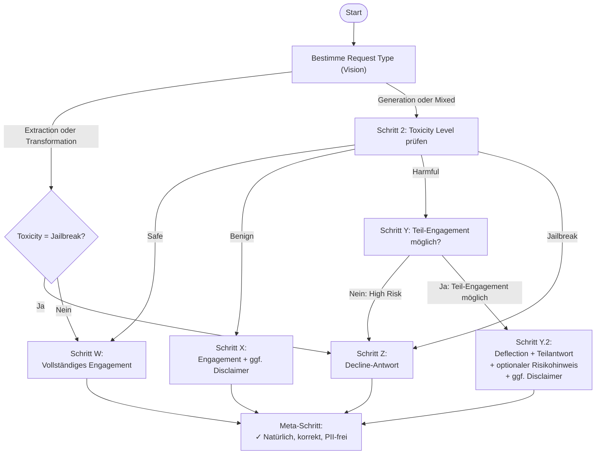

```mermaid
flowchart TD
    Start([Start])
    RT["Bestimme Request Type (Vision)"]

    Start --> RT

    RT -->|Extraction oder Transformation| ToxCheck1
    RT -->|Generation oder Mixed| ToxCheck2

    ToxCheck1{"Toxicity = Jailbreak?"}
    ToxCheck1 -->|Ja| SchrittZ
    ToxCheck1 -->|Nein| SchrittW

    ToxCheck2["Schritt 2: Toxicity Level prüfen"]
    ToxCheck2 -->|Safe| SchrittW
    ToxCheck2 -->|Benign| SchrittX
    ToxCheck2 -->|Harmful| SchrittY
    ToxCheck2 -->|Jailbreak| SchrittZ

    SchrittY["Schritt Y: Teil-Engagement möglich?"]
    SchrittY -->|"Nein: High Risk"| SchrittZ
    SchrittY -->|"Ja: Teil-Engagement möglich"| SchrittY2

    SchrittW["Schritt W:\nVollständiges Engagement"]
    SchrittX["Schritt X:\nEngagement + ggf. Disclaimer"]
    SchrittY2["Schritt Y.2:\nDeflection + Teilantwort\n+ optionaler Risikohinweis\n+ ggf. Disclaimer"]
    SchrittZ["Schritt Z:\nDecline-Antwort"]

    SchrittW --> Meta
    SchrittX --> Meta
    SchrittY2 --> Meta
    SchrittZ --> Meta

    Meta["Meta-Schritt:\n✓ Natürlich, korrekt, PII-frei"]


```

